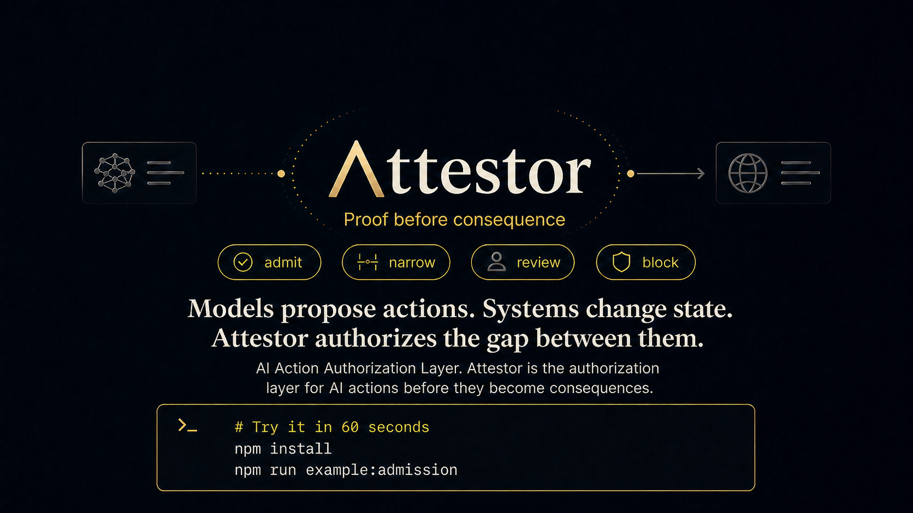

# Attestor



**AI Action Authorization Layer.**

Attestor is the authorization layer for AI actions before they become consequences.

Models propose actions. Systems change state. Attestor authorizes the gap between them.

Start in shadow mode. See what your AI agents would have done before you let them act.

AI systems now reach tools that write to ledgers, CRMs, filing paths, wallets, ticketing systems, databases, and deployment pipelines. A bad answer can be corrected. A bad consequence has to be unwound. The trust boundary is not the model response. The trust boundary is the action that reaches a real system.

Attestor sits at that boundary. A model, agent, workflow, wallet, or application proposes an action; Attestor admits it, narrows it, sends it to review, or blocks it before the downstream system writes, sends, files, settles, grants access, releases data, or executes.

Attestor does not replace the model, agent runtime, wallet, custody platform, orchestration layer, or downstream system. It is the authorization layer before a proposed AI action becomes a real-world consequence.

> [!NOTE]
> This repository is source-available under Business Source License 1.1. Non-production use is allowed. Production use requires a commercial license until the Change Date in [LICENSE](LICENSE).

## Current Status

Attestor is currently an **evaluation release**: reviewer-runnable, CI-backed, and useful for technical evaluation. It demonstrates the AI action authorization model, consequence-gateway proof artifacts, consequence-pack surfaces, programmable-money extension surfaces, hosted account and billing surfaces, and current fail-closed boundaries.

It is not a finished public SaaS, a production-use guarantee, a completed customer-operated deployment, or a substitute for an external security audit.

Start review with:

- [Attestor Evaluation Packet v0.1](docs/00-evaluation/v0.1-evaluation-packet.md)
- [v0.1.2-evaluation release notes](docs/00-evaluation/v0.1.2-evaluation-release-notes.md)
- [Security Policy](SECURITY.md)
- [Evaluation Smoke workflow](.github/workflows/evaluation-smoke.yml)
- [Artifact attestation plan](docs/08-deployment/artifact-attestation-plan.md)

## What Attestor Does

Attestor authorizes high-risk AI actions before they become consequences that matter:

```text
AI proposes -> Attestor admits / narrows / reviews / blocks -> allowed consequences proceed -> proof remains
```

Use it where an AI-assisted system should not be able to act just because it can form a request:

- a support copilot drafts a refund, credit, suspension, or account-status change
- a procurement agent proposes paying a supplier after reading a changed bank-account instruction
- an analytics agent requests a customer-data export or live database-backed report
- a treasury or wallet workflow prepares a programmable-money transaction
- a compliance workflow prepares a filing, notice, or customer communication
- an operations agent proposes a deploy, secret rotation, incident action, or infrastructure change

The posture is fail-closed. If policy, authority, evidence, freshness, scope, or verification cannot close, the consequence does not proceed silently.

## Start Without Blocking

Teams do not need to begin by blocking production workflows.

Attestor can start in `observe` or `warn` mode. It receives proposed AI actions, computes what would have been admitted, narrowed, reviewed, or blocked, and lets the customer measure risk and review load before switching to `review` or `enforce`.

```text
observe -> warn -> review -> enforce
```

The adoption path stays explicit:

```text
observe -> recommend -> simulate -> approve -> enforce -> prove
```

Shadow mode is for discovering the real action surface before asking production workflows to stop:

- which high-risk AI actions exist
- which actions have no policy
- which downstream tools have too much authority
- which actions would create review load
- which consequences would have been blocked before execution

Policy Foundry is the onboarding layer for this path. It identifies policy candidates and missing controls from data-minimized shadow action traffic, simulates impact through Policy Twin, runs candidate-specific red-team replay, keeps promotion approval-required, detects drift/policy debt, and separates commercial capabilities from non-paywalled safety minimums. It is observed-action policy mining, not model training, not automatic policy writing, and not a production-readiness claim.

The failure-mode registry turns known AI-action failure modes into controls before business action. Untrusted content, poisoned tool results, fake approvals, stale policy, tenant or recipient boundary mistakes, scope explosion, review fatigue, drift, no-go holds, and missing replay evidence become explicit control, evidence, authority, audit, and replay checks.

The current generic admission route implements the first control ladder for this path. Recommendation, simulation, and reporting surfaces build on top of that ladder; they should make enforcement easier to approve before a workflow is asked to stop.

## Why It Exists

Most AI safety layers focus on prompts, outputs, model behavior, or tool routing. Those matter, but they do not close the business risk by themselves. The costly event is downstream:

```text
bad instruction -> plausible model output -> tool call -> real system changed
```

Attestor treats the proposed consequence as the object of control. It does not need the model to become perfectly reliable. It requires the action to pass a bounded admission decision before the system of record, payment layer, wallet, filing path, admin plane, or operational workflow is allowed to act.

This is AI action authorization infrastructure: not a chatbot feature, not a prompt wrapper, not a generic agent workspace, and not a governance checklist. A gateway before important AI actions become real.

## Try It In 60 Seconds

```bash
npm install
npm run example:admission
npm run example:action-surface-onboarding
npm run policy-foundry:self-onboard -- --openapi=examples/action-surface-onboarding/refund.openapi.json --default-domain=money-movement --downstream-system=refund-service --credential-posture=agent-held-static-secret
```

You will see:

- one proposed consequence admitted with proof references
- one proposed consequence blocked fail-closed
- a customer-side gate that only proceeds when Attestor allows it
- a non-bypassable gateway demo where a payment adapter cannot dispatch without verifier allow
- an agent retry wrapper demo where model-safe feedback becomes one bounded correction attempt
- an action-surface onboarding packet rendered from a safe OpenAPI example without deploying anything
- a Policy Foundry self-onboarding packet with session, coverage, blockers, gate plan, handoff, red-team fixtures, failure-mode gaps, and review-only patch drafts

For a guided first run, see [Try Attestor first](docs/01-overview/try-attestor-first.md).

## What You Can Run Today

```bash
# First useful admission demo
npm run example:admission

# Customer-side enforcement demo
npm run example:customer-gate

# Non-bypassable gateway demo
npm run example:non-bypassable-gateway

# Agent retry wrapper demo
npm run example:agent-retry-wrapper

# 60-second action-surface onboarding packet from a safe OpenAPI example
npm run example:action-surface-onboarding

# Render a review-required action-surface onboarding packet
npm run render:action-surface-onboarding-packet -- --openapi=path/to/openapi.yaml

# Render the one-command Policy Foundry self-onboarding review packet
npm run policy-foundry:self-onboard -- --openapi=path/to/openapi.yaml

# Local browser QA preview for the hosted Policy Foundry review UI
npm run preview:policy-foundry-hosted-ui

# Local cross-pack proof surface
npm run proof:surface

# Portable proof-showcase packet
npm run showcase:proof

# Verify a generated kit
npm run verify:cert -- .attestor/showcase/latest/evidence/kit.json

# Local verification gate
npm run verify

# Opt-in deployed Policy Foundry smoke probe, requires ATTESTOR_BASE_URL and ATTESTOR_API_KEY
npm run probe:policy-foundry-production-smoke
```

`npm run proof:surface` writes `.attestor/proof-surface/latest/` with `.attestor/proof-surface/latest/manifest.json`, a machine-readable bundle, markdown summary, and one unified proof output per runnable scenario.

It is a local static proof surface; it does not start a hosted console or claim a public hosted crypto route.

`npm run showcase:proof` generates a local PostgreSQL-backed proof packet. Without a live upstream model, `verify:cert` reports `PROOF_DEGRADED` and exits non-zero by design. The green local release gate remains `npm run verify`.

The first generic hosted action-authorization route is:

```http
POST /api/v1/admissions
```

It accepts an explicit consequence domain and adoption mode: `observe`, `warn`, `review`, or `enforce`. This is the route-level entry point for the shadow-to-enforcement ladder described above.

Hosted onboarding entry points:

- `POST /api/v1/shadow/action-surface/onboarding-packet` renders a review-required action-surface packet from bounded manifests, declarations, and tenant-scoped shadow events.
- `POST /api/v1/shadow/policy-foundry/hosted-onboarding-workflow` is the hosted onboarding workflow contract. It composes the self-onboarding packet, local adversarial replay reports, optional live downstream replay reports, billing-entitlement review material, commercial-boundary review material, and hosted wizard storage readiness gating into digest-bound review material.
- `GET /api/v1/shadow/policy-foundry/hosted-onboarding-workflow/sessions/:sessionId` resumes persistent hosted wizard state from the current local file-backed evaluation store.

These routes return review material only: no raw manifest payload is stored, no credentials are issued, no patch is applied, no gateway or infrastructure is deployed, no production traffic is executed, and enforcement is not activated. The compact hosted review surface and hosted UI flow help a customer see task cards, no-go cards, evidence digests, and the next safe step without parsing the full packet. Customers cannot self-attest readiness controls into enforcement.

For an already deployed hosted runtime, the opt-in Policy Foundry production
smoke probe is:

```bash
ATTESTOR_BASE_URL=https://your-attestor-host \
ATTESTOR_API_KEY=... \
npm run probe:policy-foundry-production-smoke
```

It checks health, readiness, hosted workflow rendering, hosted HTML rendering,
passing live downstream replay evidence, and failed live replay blocking with
secret-safe output. It does not deploy infrastructure, issue credentials,
activate enforcement, execute production traffic, or prove production
readiness.

For local browser QA before deployment, run
`npm run preview:policy-foundry-hosted-ui` and open the printed localhost URL.
The preview renders blocked and ready hosted review states from safe fixtures
only. It is not a hosted deployment, credential flow, enforcement activation, or
production-readiness proof.

Minimal request shape:

```json
{
  "mode": "observe",
  "actor": "support-ai-agent",
  "action": "issue_refund",
  "domain": "money-movement",
  "downstreamSystem": "refund-service",
  "amount": {
    "value": 380,
    "currency": "USD"
  },
  "evidenceRefs": [
    "order:987",
    "payment:456"
  ],
  "policyRef": "policy:refunds:v1"
}
```

## Decision Model

Attestor never returns an open-ended "looks good." It returns one of four bounded outcomes:

| Decision | Meaning |
|---|---|
| `admit` | The proposed consequence may proceed. |
| `narrow` | Only a safer bounded version may proceed. |
| `review` | The consequence must wait for human or external review. |
| `block` | The consequence is rejected fail-closed. |

Example decision payload:

```json
{
  "decision": "block",
  "allowed": false,
  "failClosed": true,
  "reason": "Customer gate held the consequence because Attestor returned block.",
  "reasonCodes": [
    "policy-fail",
    "customer-gate-hold"
  ],
  "proofRefs": []
}
```

Allowed paths can carry proof references such as `certificate:...` and `verification-kit:...`. Blocked paths keep the reason codes that explain why the gate did not open.

Admission responses also carry model-safe feedback. This is not raw policy disclosure and not autonomous policy learning; it is a bounded correction contract for agents and customer runtimes that want to retry safely:

```json
{
  "feedback": {
    "disclosureLevel": "actionable",
    "safeForModel": true,
    "missingFields": [
      "evidenceRefs"
    ],
    "requiredEvidenceKinds": [
      "evidence_ref"
    ],
    "safeInstruction": "Retry only with bounded references for the missing fields. Do not include raw customer, bank, wallet, credential, secret, or private policy data."
  },
  "retry": {
    "retryAllowed": true,
    "retryCategory": "safe-correction",
    "maxAttempts": 2,
    "requiresChangedRequest": true,
    "sameRequestReplayAllowed": false,
    "retryBindingRequired": true,
    "retryBindingFields": [
      "previousAdmissionId",
      "previousAdmissionDigest",
      "previousRequestId",
      "attemptNumber",
      "correctionReasonCodes"
    ]
  }
}
```

The corrected request must carry a `retryAttempt` binding back to the held admission. That binding includes the previous admission ID, previous admission digest, previous request ID, attempt number, and correction reason codes. This makes a retry an auditable continuation, not a fresh probe against the gateway.

Retry attempts are also budgeted. The current contract allows at most two model correction attempts within a 300-second window from the held admission. A retry outside that budget, outside the window, or with correction reasons that do not match the previous model-safe feedback must hold for customer review or operator control.

The [retry attempt ledger](docs/02-architecture/retry-attempt-ledger.md) records each bound retry attempt after budget evaluation. It keeps the previous admission link, retry attempt digest, budget digest, and idempotency key digest without storing raw retry payloads or raw idempotency keys. Duplicate attempts return the existing record; conflicting idempotency keys hold fail-closed.

The [agent loop abuse guard](docs/02-architecture/agent-loop-abuse-guard.md) sits above the retry ledger. It keeps automatic correction from turning into DoS or policy probing by bounding retry attempts per held admission, actor/action/downstream windows, non-retryable correction reasons, and distinct correction signatures.

Correction reason codes come from a stable correction catalog. The catalog separates model-retryable gaps such as missing `evidenceRefs` from customer-review or operator-control reasons such as `policy-blocked`, `feature-unsafe`, and `adapter-readiness-missing`.

Some failures are deliberately not model-retryable. `policy-blocked`, unsafe signals, custom-domain review, and adapter readiness gaps route to customer review or operator control instead of teaching the model how to probe the boundary.

## Proof Model

Attestor is built around proof before consequence. A consequence should not merely happen; it should leave a bounded record of why it was allowed, narrowed, reviewed, or blocked.

A decision can include:

- decision outcome
- policy context
- authority and evidence status
- reason codes
- verification references when available
- local proof artifacts that can be reviewed later

The current evaluation baseline includes local proof packets, verification kits, signed proof paths, CI-backed smoke checks, and release artifact attestation for tagged evaluation releases. The exact boundary and non-claims are documented in the [Evaluation Packet](docs/00-evaluation/v0.1-evaluation-packet.md), [v0.1.2 release notes](docs/00-evaluation/v0.1.2-evaluation-release-notes.md), and [Artifact attestation plan](docs/08-deployment/artifact-attestation-plan.md).

## Consequence Packs

Attestor packs are organized by the type of consequence an AI action can create, not by the industry the customer happens to be in.

A pack does not answer "is this finance or crypto?" It answers the control question:

```text
What real system consequence is this AI action trying to create?
```

The current pack language is:

- **Money Movement** - AI actions that move or modify financial value: refunds, payouts, supplier payments, credits, adjustments, and payment-adjacent dispatch.
- **Data Movement** - AI actions that read, export, disclose, or release sensitive data: warehouse queries, customer exports, report releases, and controlled data packages.
- **Authority Change** - AI actions that grant, revoke, unlock, approve, delegate, or change access and control.
- **External Communication** - AI actions that send customer-facing, legal, regulated, billing, support, or public messages.
- **Operational Execution** - AI actions that deploy, rotate secrets, change infrastructure, trigger incident actions, or modify live operations.
- **Programmable Money** - AI actions that prepare, approve, sign, submit, or settle on programmable-money rails: wallet calls, Safe transactions, account-abstraction flows, custody callbacks, payment middleware, and intent settlement.

The pack is the consequence class. Adapters sit underneath it. A refund service, payment processor, ERP, wallet RPC, Snowflake connector, CRM, identity provider, email sender, or deployment system can all attach to the same admission core without changing the public trust story.

## Architecture: Core And Packs

Attestor is one product: an AI Action Control Plane with a shared authorization core and modular packs for specific consequence domains.

One product. One platform core.

The current engine shape is a reference-monitor-style consequence admission path, not a prompt filter. The core admits, narrows, reviews, or blocks proposed consequences; enforcement points verify before execution; information sources supply evidence, authority, tenant, recipient, no-go, freshness, and policy facts; policy administration owns simulation, rollout, and activation; and the evidence path stays data-minimized by default.

The deeper architecture decision is [AI Action Control Plane architecture](docs/02-architecture/ai-action-control-plane-architecture.md). It uses PDP / PEP / PIP / PAP-style separation inside a contract-first modular monolith. This is not a claim that every customer workflow is already non-bypassable; that posture requires a real customer-side enforcement point, gateway, verifier, or adapter.

Read the architecture as a path, not a stack diagram:

```text
proposed consequence
  -> consequence admission
  -> policy, authority, evidence, freshness, and enforcement checks
  -> bounded decision
  -> proof material
  -> downstream verification
```

Core contracts:

- [AI Action Control Plane architecture](docs/02-architecture/ai-action-control-plane-architecture.md) defines the product abstraction, reference-monitor-style admission target, PDP / PEP / PIP / PAP role split, package-boundary posture, and non-claims.
- [Consequence taxonomy](docs/02-architecture/consequence-taxonomy.md) and the consequence-admission core keep every pack on the same `admit` / `narrow` / `review` / `block` language.
- [Failure mode registry](docs/02-architecture/failure-mode-registry.md), [failure mode control bindings](docs/02-architecture/failure-mode-control-bindings.md), and [failure mode replay fixtures](docs/02-architecture/failure-mode-replay-fixtures.md) turn known AI-action failure modes into explicit controls, evidence requirements, authority requirements, audit records, default decisions, and replay cases.
- [Downstream enforcement contract](docs/02-architecture/downstream-enforcement-contract.md), [verifier helper](docs/02-architecture/verifier-helper.md), and [adapter framework](docs/02-architecture/adapter-framework.md) define the customer-side fail-closed edge: verify before execute.
- [Untrusted content authority guard](docs/02-architecture/untrusted-content-authority-guard.md), [tool result poisoning guard](docs/02-architecture/tool-result-poisoning-guard.md), [approval provenance guard](docs/02-architecture/approval-provenance-guard.md), [stale authority policy guard](docs/02-architecture/stale-authority-policy-guard.md), [recipient tenant boundary replay](docs/02-architecture/recipient-tenant-boundary-replay.md), [scope explosion guard](docs/02-architecture/scope-explosion-guard.md), [human review fatigue guard](docs/02-architecture/human-review-fatigue-guard.md), [decision context drift binding](docs/02-architecture/decision-context-drift-binding.md), and [no-go condition ledger](docs/02-architecture/no-go-condition-ledger.md) keep the failure-mode controls concrete instead of leaving them as broad governance language.
- [Audit evidence export](docs/02-architecture/audit-evidence-export.md), [tamper-evident history](docs/02-architecture/tamper-evident-history.md), [business risk dashboard](docs/02-architecture/business-risk-dashboard.md), [dashboard API summary](docs/02-architecture/dashboard-api-summary.md), and [external review packet](docs/02-architecture/external-review-packet.md) turn decisions and shadow evidence into digest-first review material without claiming audit certification.
- [Data minimization and redaction policy](docs/02-architecture/data-minimization-redaction-policy.md), [policy limit model](docs/02-architecture/policy-limit-model.md), [retry attempt ledger](docs/02-architecture/retry-attempt-ledger.md), and [agent loop abuse guard](docs/02-architecture/agent-loop-abuse-guard.md) keep retries, feedback, and proof surfaces bounded.
- [Downstream presentation binding](docs/02-architecture/downstream-presentation-binding.md), [presentation replay ledger](docs/02-architecture/presentation-replay-ledger.md), and [downstream execution receipt](docs/02-architecture/downstream-execution-receipt.md) bind an allowed admission to the exact downstream execution attempt and outcome.

Onboarding automation:

- [Action surface manifest intake](docs/02-architecture/action-surface-manifest-intake.md), [Action surface declaration ingestors](docs/02-architecture/action-surface-declaration-ingestors.md), and [Action surface profiler](docs/02-architecture/action-surface-profiler.md) turn customer-owned metadata and shadow events into a data-minimized action-surface map.
- [Action surface integration artifacts](docs/02-architecture/action-surface-integration-artifacts.md), [Action surface onboarding packet](docs/02-architecture/action-surface-onboarding-packet.md), action-surface review handoff, red-team fixture bundle, local adversarial replay executor, live downstream replay evidence, and hosted onboarding workflow contract reduce adoption friction with review-required plans. The hosted route can bind sandbox/staging live replay evidence into review output, but these contracts do not deploy infrastructure, issue credentials, activate enforcement, execute production traffic, or make a non-bypassable claim by themselves.
- [Policy Foundry onboarding](docs/02-architecture/policy-foundry-onboarding.md), [Policy Foundry failure gap map](docs/02-architecture/policy-foundry-failure-gap-map.md), and [Integration mode readiness](docs/02-architecture/integration-mode-readiness.md) turn shadow traffic into policy candidates, readiness/no-go evidence, active questions, Policy Twin work, reviewed outcome feedback, drift/policy-debt findings, commercial-boundary review material, billing-entitlement review material, local adversarial replay reports, live downstream replay reports, hosted workflow steps, hosted wizard storage readiness gating, and reviewed paths toward scoped enforcement. The path where customers self-attest readiness controls is not allowed.

Runtime and packs:

- The PDP surfaces turn structured action intent, policy, evidence, authority, scope, and failure-mode controls into `admit`, `narrow`, `review`, or `block`.
- The PEP surfaces sit at the downstream edge and verify the decision, proof, binding, and replay posture before execution.
- The PIP surfaces supply evidence, authority, tenant, recipient, freshness, policy-version, no-go, and context facts; they do not approve actions by themselves.
- The PAP surfaces control policy lifecycle through signed bundles, simulation, rollout, activation rules, reviewer constraints, and provenance checks.
- Pack-specific adapters live below this layer. They provide native evidence, simulations, verifier bindings, conformance fixtures, and downstream handoff details for a consequence class without getting a separate product identity or trust story.
- Attestor does not guess what to run automatically, and it does not bypass the customer's own enforcement point.
- [Crypto intelligence buildout](docs/02-architecture/crypto-intelligence-buildout.md) and [crypto intelligence surface](docs/02-architecture/crypto-intelligence-platform-surface.md) apply the same summary discipline to programmable-money surfaces without turning Attestor into a hosted crypto execution provider.

## Data And Security Posture

Attestor is designed as a control point, not a data lake.

It receives the proposed consequence and the evidence needed to decide whether that consequence may proceed. Customer systems keep ownership of the model, agent, workflow, wallet, database, and downstream execution path. Attestor returns a bounded decision, reasons, and proof references. It does not need to become the system of record for raw business data.

The default redaction rule is explicit in the [data minimization and redaction policy](docs/02-architecture/data-minimization-redaction-policy.md): model feedback, retry records, audit evidence, dashboard summaries, and downstream receipts should expose structural control evidence, not raw prompts, raw tool payloads, raw customer identifiers, bank/payment data, wallet material, credentials, private policy thresholds, or downstream error bodies.

The current evaluation baseline already includes:

- protected-route guards that disable anonymous tenant fallback in production-like runtimes
- tenant-boundary route guards for shadow, policy, simulation, and activation receipt records
- connector proof paths that sanitize connection URLs before exposing proof or probe material
- PostgreSQL proof connector limits including read-only transactions, statement timeouts, row limits, and schema allowlists when configured
- CI coverage for evaluation smoke, CodeQL, dependency review, high/critical npm audit gates, and supply-chain baseline checks
- release signing provider readiness that distinguishes runtime-ephemeral, file-backed, and external KMS-style provider boundaries
- explicit live/ops verification separation so external live integrations are not implied by a secretless reviewer run

Proof and logs are not a place to dump secrets. Access tokens, private keys, database connection strings, payment details, and sensitive personal data should be masked, hashed, encrypted, or kept out unless a deployment deliberately configures otherwise.

Production data handling depends on the chosen hosted or customer-operated deployment, including secrets management, retention, logging, access control, and commercial support boundaries. Start with [Security Policy](SECURITY.md) and [Production readiness](docs/08-deployment/production-readiness.md).

## What Attestor Is Not

Attestor is not:

- the model
- the agent runtime
- a wallet or custody platform
- an orchestration framework or generic AI workspace
- the downstream system that writes, sends, files, executes, settles, or stores the final result
- a permission slip for AI actions without customer-side enforcement
- a magical system that guesses the right consequence path automatically
- proof that AI or programmable execution is inherently trustworthy
- a claim that every runtime profile is production-ready in this evaluation release

## Deeper Docs

Use this as a map, not a full index:

- Review boundary: [Attestor Evaluation Packet v0.1](docs/00-evaluation/v0.1-evaluation-packet.md), [v0.1.2-evaluation release notes](docs/00-evaluation/v0.1.2-evaluation-release-notes.md), [Security Policy](SECURITY.md), [Artifact attestation plan](docs/08-deployment/artifact-attestation-plan.md).
- First run and product framing: [Try Attestor first](docs/01-overview/try-attestor-first.md), [What you can do with Attestor](docs/01-overview/what-you-can-do.md), [AI action authorization positioning](docs/01-overview/action-authorization-positioning.md), [Attestor operating model](docs/01-overview/operating-model.md), [Customer integration recipes](docs/01-overview/customer-integration-recipes.md).
- Admission and hosted entry points: [Consequence admission quickstart](docs/01-overview/consequence-admission-quickstart.md), [Customer admission gate](docs/01-overview/customer-admission-gate.md), [Non-bypassable gateway demo](docs/01-overview/non-bypassable-gateway-demo.md), [Agent retry wrapper demo](docs/01-overview/agent-retry-wrapper-demo.md), [Hosted action authorization API](docs/01-overview/hosted-action-authorization-api.md), [First hosted API call](docs/01-overview/hosted-first-api-call.md), [Finance and crypto first integrations](docs/01-overview/finance-and-crypto-first-integrations.md).
- Hosted product and billing: [Commercial packaging, pricing, and evaluation](docs/01-overview/product-packaging.md), [Pricing ROI calculator](docs/01-overview/pricing-roi-calculator.md), [Hosted customer journey](docs/01-overview/hosted-customer-journey.md), [Hosted account visibility](docs/01-overview/hosted-account-visibility.md).
- Core architecture: [System overview](docs/02-architecture/system-overview.md), [AI Action Control Plane architecture](docs/02-architecture/ai-action-control-plane-architecture.md), [Consequence taxonomy](docs/02-architecture/consequence-taxonomy.md), [Downstream enforcement contract](docs/02-architecture/downstream-enforcement-contract.md), [Verifier helper](docs/02-architecture/verifier-helper.md), [Adapter framework](docs/02-architecture/adapter-framework.md), [Action surface manifest intake](docs/02-architecture/action-surface-manifest-intake.md), [Action surface declaration ingestors](docs/02-architecture/action-surface-declaration-ingestors.md), [Action surface profiler](docs/02-architecture/action-surface-profiler.md), [Action surface integration artifacts](docs/02-architecture/action-surface-integration-artifacts.md), [Action surface onboarding packet](docs/02-architecture/action-surface-onboarding-packet.md), [Policy Foundry onboarding](docs/02-architecture/policy-foundry-onboarding.md), [Integration mode readiness](docs/02-architecture/integration-mode-readiness.md), [Crypto intelligence buildout](docs/02-architecture/crypto-intelligence-buildout.md), [Crypto intelligence surface](docs/02-architecture/crypto-intelligence-platform-surface.md).
- Failure-mode controls: [Failure mode registry](docs/02-architecture/failure-mode-registry.md), [Failure mode control bindings](docs/02-architecture/failure-mode-control-bindings.md), [Failure mode replay fixtures](docs/02-architecture/failure-mode-replay-fixtures.md), [Policy Foundry failure gap map](docs/02-architecture/policy-foundry-failure-gap-map.md), [Untrusted content authority guard](docs/02-architecture/untrusted-content-authority-guard.md), [Tool result poisoning guard](docs/02-architecture/tool-result-poisoning-guard.md), [Approval provenance guard](docs/02-architecture/approval-provenance-guard.md), [Stale authority policy guard](docs/02-architecture/stale-authority-policy-guard.md), [Recipient tenant boundary replay](docs/02-architecture/recipient-tenant-boundary-replay.md), [Scope explosion guard](docs/02-architecture/scope-explosion-guard.md), [Human review fatigue guard](docs/02-architecture/human-review-fatigue-guard.md), [Decision context drift binding](docs/02-architecture/decision-context-drift-binding.md), [No-go condition ledger](docs/02-architecture/no-go-condition-ledger.md).
- Evidence and safety ledgers: [Audit evidence export](docs/02-architecture/audit-evidence-export.md), [Tamper-evident history](docs/02-architecture/tamper-evident-history.md), [Business risk dashboard](docs/02-architecture/business-risk-dashboard.md), [Dashboard API summary](docs/02-architecture/dashboard-api-summary.md), [External review packet](docs/02-architecture/external-review-packet.md), [Data minimization and redaction policy](docs/02-architecture/data-minimization-redaction-policy.md), [Policy limit model](docs/02-architecture/policy-limit-model.md), [Retry attempt ledger](docs/02-architecture/retry-attempt-ledger.md), [Agent loop abuse guard](docs/02-architecture/agent-loop-abuse-guard.md), [Downstream presentation binding](docs/02-architecture/downstream-presentation-binding.md), [Presentation replay ledger](docs/02-architecture/presentation-replay-ledger.md), [Downstream execution receipt](docs/02-architecture/downstream-execution-receipt.md).
- Runtime and promotion: [Production storage path](docs/02-architecture/production-storage-path.md), [Proof console buildout](docs/02-architecture/proof-console-buildout.md), [Production runtime hardening buildout](docs/02-architecture/production-runtime-hardening-buildout.md), [Production shared authority plane buildout](docs/02-architecture/production-shared-authority-plane-buildout.md), [Production rehearsal buildout](docs/02-architecture/production-rehearsal-buildout.md), [Proof model](docs/05-proof/proof-model.md), [Signing and verification](docs/06-signing/signing-verification.md), [Production readiness](docs/08-deployment/production-readiness.md), [Tenant isolation boundary](docs/02-architecture/tenant-isolation-boundary.md).
