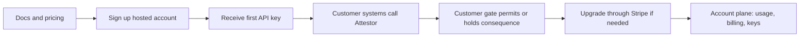

# Hosted Customer Journey

This document covers the hosted buying and onboarding flow only.

For plan definitions, pricing, free evaluation, hosted trial posture, hosted vs customer-operated packaging, and the production licensing boundary, use [Commercial packaging, pricing, and evaluation](product-packaging.md) as the source of truth.

For exact hosted route order, auth boundaries, success signals, and failure signals, use [Hosted journey contract](hosted-journey-contract.md).

For the first customer-owned API call after signup, use [First hosted API call](hosted-first-api-call.md).

For the first finance and crypto integration paths, use [Finance and crypto first integrations](finance-and-crypto-first-integrations.md).

For current plan, usage, entitlement, feature, and billing visibility, use [Hosted account visibility](hosted-account-visibility.md).

## What this path is for

The hosted path is for teams that want a managed Attestor product surface without turning Attestor into the place where their files, workflows, wallets, or business systems live.

The customer keeps those systems where they already are, then calls Attestor where release decisions, proof, verification, authorization, and operational control are required.

## The 4-step view

The hosted path should be easy to understand:

1. create the hosted account
2. receive the first API key
3. make the first Attestor API call before consequence
4. enforce the customer-side admission gate before the downstream action
5. upgrade through Stripe Checkout if a paid hosted plan is needed

After that, the same account remains the control point for keys, usage, entitlement, and billing.

The concrete account-plane visibility map lives in [Hosted account visibility](hosted-account-visibility.md).

## Buying flow

The first hosted commercial flow is:

1. the customer reads the docs and chooses a hosted plan
2. the customer signs up for a hosted account
3. Attestor returns the first tenant API key
4. the customer calls Attestor from their own environment before a consequence
5. the customer upgrades through Stripe Checkout when moving to a paid hosted plan
6. the same account carries the paid entitlement after checkout
7. the customer manages keys, usage, and billing from the hosted account plane

## What to send and when

Use this sequence:

1. create the account
   send `accountName`, `email`, `displayName`, and `password` to `POST /api/v1/auth/signup`
2. use the one-time plaintext `initialKey.apiKey` as `Authorization: Bearer <tenant_api_key>`
3. make the first hosted API call with `POST /api/v1/pipeline/run`
4. project the response with `attestor/consequence-admission` and enforce the customer-side gate before the downstream action
5. inspect usage or entitlement with `GET /api/v1/account/usage`, `GET /api/v1/account/entitlement`, or `GET /api/v1/account`
6. inspect feature or billing state with `GET /api/v1/account/features`, `GET /api/v1/account/billing/export`, or `GET /api/v1/account/billing/reconciliation`
7. start checkout for a paid hosted plan
   send `planId` (`starter`, `pro`, `scale`, or `enterprise`) to `POST /api/v1/account/billing/checkout`
8. open the returned `checkoutUrl` and finish payment in Stripe
9. keep using the same account after checkout completes
10. manage billing later through `POST /api/v1/account/billing/portal`

The concrete first API-call and gate example lives in [First hosted API call](hosted-first-api-call.md).

## Minimum hosted account plane

The hosted account plane only needs to cover:

- current plan, entitlement, and feature state
- usage against quota and rate limit
- API key lifecycle
- billing checkout, billing portal, export, and reconciliation visibility
- onboarding and docs links

That is enough to make the hosted product purchasable and usable.

## Hosted route contract

The canonical contract lives in [Hosted journey contract](hosted-journey-contract.md). The hosted customer journey already maps to the shipped API surface:

- `POST /api/v1/auth/signup`
- `POST /api/v1/auth/login`
- `GET /api/v1/auth/me`
- `GET /api/v1/account`
- `GET /api/v1/account/usage`
- `GET /api/v1/account/entitlement`
- `GET /api/v1/account/features`
- `GET /api/v1/account/api-keys`
- `POST /api/v1/account/api-keys`
- `POST /api/v1/account/api-keys/:id/rotate`
- `POST /api/v1/account/api-keys/:id/deactivate`
- `POST /api/v1/account/api-keys/:id/reactivate`
- `POST /api/v1/account/api-keys/:id/revoke`
- `POST /api/v1/account/billing/checkout`
- `POST /api/v1/account/billing/portal`
- `GET /api/v1/account/billing/export`
- `GET /api/v1/account/billing/reconciliation`
- `POST /api/v1/billing/stripe/webhook`

## What this document does not do

This document does not define:

- pricing
- plan packaging
- customer-operated deployment packaging
- production licensing terms

Those live in [Commercial packaging, pricing, and evaluation](product-packaging.md).
