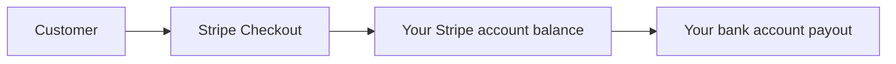

# Stripe Commercial Bootstrap

This is the minimum operator checklist for workflow-based Stripe launch
preparation. It is not a public pricing page and it is not live billing proof.

For the current account-plan public packaging source, use
[Commercial packaging, pricing, and evaluation](product-packaging.md). For the
workflow launch-prep model, use
[Attestor Workflow-Based Launch Packaging Plan](launch-packaging-plan.md).
This document is operator-facing and should not become a second public pricing
page.
This page is operator-facing and should not become a second public pricing page.

## What Customers See

From the customer's side, the commercial shape stays simple:

1. choose a workflow tier
2. sign up for a hosted account
3. buy a workflow through Stripe Checkout when `pilot-workflow`,
   `starter-workflow`, or `pro-workflow` is needed
4. return to the Attestor account plane
5. manage API keys, workflow usage, and billing

Customers do not need to understand your payout setup. They only need a clear plan choice and a reliable checkout path.

## What You Must Set Up As The Operator

### 1. Bootstrap The Stripe Catalog, Meter, Portal, And Webhook

The preferred operator path is the repo bootstrap script. It creates or reuses:

- the Pilot Workflow, Starter Workflow, and Pro Workflow Stripe products
- the monthly base prices for those workflow products
- the shared `attestor_admission_overage` Billing Meter
- the metered monthly overage price for Starter Workflow and Pro Workflow
- the default Customer Portal configuration for workflow price switching
- the Stripe webhook endpoint and supported billing events

Run it with the Stripe account you want to configure:

```bash
STRIPE_API_KEY=sk_live_... \
ATTESTOR_PUBLIC_BASE_URL=https://<host> \
ATTESTOR_BILLING_PORTAL_RETURN_URL=https://<host>/settings/billing \
npm run bootstrap:stripe-commercial
```

For sandbox setup, use `sk_test_...` and then run the readiness probe with `--allow-test-mode=true`.

Restricted live keys are supported for the catalog, meter, portal, and webhook bootstrap path. The full readiness probe also reads Stripe account onboarding state, so that restricted key must include account KYC basic read permission or the probe will fail before it can report `chargesEnabled`, `payoutsEnabled`, and `detailsSubmitted`.

If the webhook endpoint is created during this run, Stripe returns the webhook signing secret once in the JSON output. Store it immediately as `STRIPE_WEBHOOK_SECRET`. If the endpoint already exists, reveal or rotate the secret in Stripe Dashboard and store that value instead.

### Manual Shape The Script Enforces

Create recurring monthly Stripe base prices for:

- `pilot-workflow`
- `starter-workflow`
- `pro-workflow`

Create one Stripe Billing Meter for admission overage:

- event name: `attestor_admission_overage`
- customer mapping payload key: `stripe_customer_id`
- value payload key: `value`
- aggregation: `sum`

Then create recurring metered monthly overage prices attached to that meter:

- Starter Workflow overage: USD `$0.05` per admission
- Pro Workflow overage: USD `$0.025` per admission

Pilot Workflow has no automatic overage at launch. Do not create Scale or
Enterprise self-service prices unless those tiers are intentionally re-enabled
after a separate readiness pass.

Those live Stripe prices should mirror
[Attestor Workflow-Based Launch Packaging Plan](launch-packaging-plan.md)
until the public packaging source is intentionally switched.

Map those live Stripe price ids into:

- `ATTESTOR_STRIPE_PRICE_PILOT_WORKFLOW`
- `ATTESTOR_STRIPE_PRICE_STARTER_WORKFLOW`
- `ATTESTOR_STRIPE_PRICE_PRO_WORKFLOW`
- `ATTESTOR_STRIPE_OVERAGE_PRICE_STARTER_WORKFLOW`
- `ATTESTOR_STRIPE_OVERAGE_PRICE_PRO_WORKFLOW`

Leave `ATTESTOR_STRIPE_PRICE_SCALE` and `ATTESTOR_STRIPE_PRICE_ENTERPRISE`
unset unless Scale or Enterprise self-service checkout is intentionally
enabled later.

For the shipped default hosted funnel:

- `trial` stays outside Stripe as the free account-level evaluation path
- legacy local records with `community` resolve to `developer`
- `pilot-workflow` is the first paid workflow tier
- paid workflow trials are not enabled by default; the `trial` plan is a free
  shadow onboarding state, not a Stripe Checkout trial
- workflow checkout and webhook convergence must bind each paid subscription
  item to a workflow entitlement before paid workflow capabilities activate

### 2. Activate Your Stripe Live Account

The hosted paid plans are not truly live until the Stripe account itself is live-ready.

That usually means:

- legal business details entered in Stripe
- support/business profile completed
- payout account configured
- live API key available

Verify that account state from the repo after the Dashboard setup:

```bash
STRIPE_API_KEY=sk_live_... \
ATTESTOR_STRIPE_PRICE_PILOT_WORKFLOW=price_... \
ATTESTOR_STRIPE_PRICE_STARTER_WORKFLOW=price_... \
ATTESTOR_STRIPE_PRICE_PRO_WORKFLOW=price_... \
ATTESTOR_STRIPE_OVERAGE_PRICE_STARTER_WORKFLOW=price_... \
ATTESTOR_STRIPE_OVERAGE_PRICE_PRO_WORKFLOW=price_... \
npm run probe:stripe-live-readiness
```

This probe checks:

- the API key is live-mode
- Stripe account details, charge capability, and payout capability are enabled
- the Pilot Workflow, Starter Workflow, and Pro Workflow price ids are active
  live monthly USD prices matching the workflow model
- the Starter Workflow and Pro Workflow overage prices are active live monthly
  metered USD prices attached to the `attestor_admission_overage` meter
- the default Stripe Customer Portal configuration is active
- the default Stripe Customer Portal lets customers switch between the
  configured Pilot, Starter, and Pro Workflow prices
- quantity changes are disabled in the Customer Portal, because workflow
  entitlements must bind to workflow ids rather than seat quantities
- Customer Portal subscription updates use `proration_behavior=none`, with
  cheaper-plan and shorter-interval changes scheduled for the end of the
  billing period when Stripe exposes those conditions

It cannot enter legal, tax, or payout identity details for you. Configure
those in Stripe Dashboard, then rerun the probe until it returns `"ok": true`.

To print the expected price manifest without a Stripe API key:

```bash
npm run probe:stripe-live-readiness -- --print-required-prices
```

That command prints both the required price manifest and the required Customer
Portal posture. Use it before changing Stripe Dashboard settings so the
dashboard stays aligned with the repo plan catalog.

## When Your Bank Details Are Needed

Your bank details are needed when you want Stripe to pay out your sales balance to you.

The money flow is:



So the sequence is:

1. the customer pays Stripe
2. Stripe receives and records the charge
3. Stripe transfers your available balance to the bank account you connected for payouts

That means:

- the bank account is part of **your Stripe live setup**
- it is **not** something Attestor stores or handles
- it is **not** required for free `developer` or `trial` evaluation paths
- it **is** required before you can honestly call the product commercially live

## 3. Configure The Attestor Runtime

Set these runtime variables on the hosted deployment:

```bash
export STRIPE_API_KEY=sk_live_...
export STRIPE_WEBHOOK_SECRET=whsec_...
export ATTESTOR_STRIPE_PRICE_PILOT_WORKFLOW=price_...
export ATTESTOR_STRIPE_PRICE_STARTER_WORKFLOW=price_...
export ATTESTOR_STRIPE_PRICE_PRO_WORKFLOW=price_...
export ATTESTOR_STRIPE_OVERAGE_PRICE_STARTER_WORKFLOW=price_...
export ATTESTOR_STRIPE_OVERAGE_PRICE_PRO_WORKFLOW=price_...
export ATTESTOR_STRIPE_OVERAGE_METER_EVENT_NAME=attestor_admission_overage
# Optional only when Scale or Enterprise self-service checkout is intentionally enabled:
# export ATTESTOR_STRIPE_PRICE_SCALE=price_...
# export ATTESTOR_STRIPE_PRICE_ENTERPRISE=price_...
export ATTESTOR_BILLING_SUCCESS_URL=https://<host>/billing/success
export ATTESTOR_BILLING_CANCEL_URL=https://<host>/billing/cancel
export ATTESTOR_BILLING_PORTAL_RETURN_URL=https://<host>/settings/billing
```

## 4. Wire The Webhook

Create a Stripe webhook endpoint that targets:

- `POST /api/v1/billing/stripe/webhook`

Print the exact operator manifest from the repo before creating or editing the endpoint:

```bash
ATTESTOR_PUBLIC_HOSTNAME=<host> npm run probe:stripe-webhook-config -- --print-required-events
```

The endpoint must enable these Attestor-supported Stripe event types:

- `checkout.session.completed`
- `customer.subscription.created`
- `customer.subscription.updated`
- `customer.subscription.deleted`
- `customer.subscription.paused`
- `customer.subscription.resumed`
- `invoice.paid`
- `invoice.payment_failed`
- `charge.succeeded`
- `charge.failed`
- `charge.refunded`
- `entitlements.active_entitlement_summary.updated`

After creating the endpoint and copying its signing secret into
`STRIPE_WEBHOOK_SECRET`, verify the live Stripe configuration:

```bash
STRIPE_API_KEY=sk_live_... \
ATTESTOR_PUBLIC_HOSTNAME=<host> \
npm run probe:stripe-webhook-config
```

Stripe webhooks are what make the billing state actually converge back into Attestor:

- checkout completion
- subscription state changes
- invoice outcomes
- charge outcomes
- entitlement updates

Without the webhook, checkout can start, but the hosted account state is not truly production-grade.

## 5. Keep The Runtime Flow Small

Attestor does not need a large commercial frontend to be sellable.

The minimum valid commercial surface is:

- workflow packaging information in repo/docs
- hosted signup
- Stripe Checkout upgrade path
- account plane for keys, usage, and billing

That is enough to make the hosted API product purchasable.

## What "Commercially Live" Means For Attestor

Attestor is commercially live when all of these are true:

- live Stripe workflow prices exist
- Stripe live account is activated
- payout bank account is connected in Stripe
- Attestor runtime has the live Stripe workflow env vars
- Stripe webhook is pointed at the live Attestor deployment
- a paid workflow checkout can complete and reflect back into the hosted account plane
- each paid subscription item is bound to one workflow entitlement
- an over-quota paid workflow admission emits a Stripe Billing Meter Event for
  the subscribed customer

Until workflow checkout, webhook convergence, runtime entitlement loading, and
live proof are all verified, this remains launch preparation rather than fully
sale-ready live billing.
