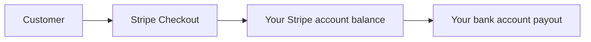

# Stripe Commercial Bootstrap

This is the minimum operator checklist for turning Attestor from a technically live hosted API into a product that customers can actually buy.

For public plan definitions, pricing, free evaluation, and hosted trial posture, use [Commercial packaging, pricing, and evaluation](product-packaging.md) as the source of truth. This document is operator-facing and should not become a second public pricing page.

## What Customers See

From the customer's side, the commercial shape stays simple:

1. choose a plan
2. sign up for a hosted account
3. upgrade through Stripe Checkout when `starter`, `pro`, or `scale` is needed
4. return to the Attestor account plane
5. manage API keys, usage, and billing

Customers do not need to understand your payout setup. They only need a clear plan choice and a reliable checkout path.

## What You Must Set Up As The Operator

### 1. Create The Live Stripe Prices

Create recurring Stripe prices for:

- `starter`
- `pro`
- `scale`

Do not create an Enterprise self-service price unless you intentionally want Enterprise checkout. The default commercial model keeps Enterprise sales/custom.

Those live Stripe prices should mirror [Commercial packaging, pricing, and evaluation](product-packaging.md).

Map those live Stripe price ids into:

- `ATTESTOR_STRIPE_PRICE_STARTER`
- `ATTESTOR_STRIPE_PRICE_PRO`
- `ATTESTOR_STRIPE_PRICE_SCALE`

Leave `ATTESTOR_STRIPE_PRICE_ENTERPRISE` unset unless Enterprise self-service checkout is intentionally enabled.

For the shipped default hosted funnel:

- `developer` and `trial` stay outside Stripe as free evaluation paths
- legacy local records with `community` resolve to `developer`
- `starter` is the first paid hosted plan
- paid plan trials are not enabled by default; the `trial` plan is a free shadow onboarding state, not a Stripe Checkout trial
- any change to public price, free trial posture, or paid checkout behavior should be reflected first in [Commercial packaging, pricing, and evaluation](product-packaging.md)

### 2. Activate Your Stripe Live Account

The hosted paid plans are not truly live until the Stripe account itself is live-ready.

That usually means:

- legal business details entered in Stripe
- support/business profile completed
- payout account configured
- live API key available

Verify that account state from the repo after the Dashboard setup:

```bash
STRIPE_API_KEY=sk_live_... \
ATTESTOR_STRIPE_PRICE_STARTER=price_... \
ATTESTOR_STRIPE_PRICE_PRO=price_... \
ATTESTOR_STRIPE_PRICE_SCALE=price_... \
npm run probe:stripe-live-readiness
```

This probe checks:

- the API key is live-mode
- Stripe account details, charge capability, and payout capability are enabled
- the Starter, Pro, and Scale price ids are active live monthly USD prices matching the commercial model
- the default Stripe Customer Portal configuration is active

It cannot enter legal, tax, payout, or Customer Portal settings for you. Configure those in Stripe Dashboard, then rerun the probe until it returns `"ok": true`.

To print the expected price manifest without a Stripe API key:

```bash
npm run probe:stripe-live-readiness -- --print-required-prices
```

## When Your Bank Details Are Needed

Your bank details are needed when you want Stripe to pay out your sales balance to you.

The money flow is:



So the sequence is:

1. the customer pays Stripe
2. Stripe receives and records the charge
3. Stripe transfers your available balance to the bank account you connected for payouts

That means:

- the bank account is part of **your Stripe live setup**
- it is **not** something Attestor stores or handles
- it is **not** required for free `developer` or `trial` evaluation paths
- it **is** required before you can honestly call the product commercially live

## 3. Configure The Attestor Runtime

Set these runtime variables on the hosted deployment:

```bash
export STRIPE_API_KEY=sk_live_...
export STRIPE_WEBHOOK_SECRET=whsec_...
export ATTESTOR_STRIPE_PRICE_STARTER=price_...
export ATTESTOR_STRIPE_PRICE_PRO=price_...
export ATTESTOR_STRIPE_PRICE_SCALE=price_...
# Optional only when Enterprise self-service checkout is intentionally enabled:
# export ATTESTOR_STRIPE_PRICE_ENTERPRISE=price_...
export ATTESTOR_BILLING_SUCCESS_URL=https://<host>/billing/success
export ATTESTOR_BILLING_CANCEL_URL=https://<host>/billing/cancel
export ATTESTOR_BILLING_PORTAL_RETURN_URL=https://<host>/settings/billing
```

## 4. Wire The Webhook

Create a Stripe webhook endpoint that targets:

- `POST /api/v1/billing/stripe/webhook`

Print the exact operator manifest from the repo before creating or editing the endpoint:

```bash
ATTESTOR_PUBLIC_HOSTNAME=<host> npm run probe:stripe-webhook-config -- --print-required-events
```

The endpoint must enable these Attestor-supported Stripe event types:

- `checkout.session.completed`
- `customer.subscription.created`
- `customer.subscription.updated`
- `customer.subscription.deleted`
- `customer.subscription.paused`
- `customer.subscription.resumed`
- `invoice.paid`
- `invoice.payment_failed`
- `charge.succeeded`
- `charge.failed`
- `charge.refunded`
- `entitlements.active_entitlement_summary.updated`

After creating the endpoint and copying its signing secret into `STRIPE_WEBHOOK_SECRET`, verify the live Stripe configuration:

```bash
STRIPE_API_KEY=sk_live_... \
ATTESTOR_PUBLIC_HOSTNAME=<host> \
npm run probe:stripe-webhook-config
```

Stripe webhooks are what make the billing state actually converge back into Attestor:

- checkout completion
- subscription state changes
- invoice outcomes
- charge outcomes
- entitlement updates

Without the webhook, checkout can start, but the hosted account state is not truly production-grade.

## 5. Keep The Runtime Flow Small

Attestor does not need a large commercial frontend to be sellable.

The minimum valid commercial surface is:

- pricing information in repo/docs
- hosted signup
- Stripe Checkout upgrade path
- account plane for keys, usage, and billing

That is enough to make the hosted API product purchasable.

## What "Commercially Live" Means For Attestor

Attestor is commercially live when all of these are true:

- live Stripe prices exist
- Stripe live account is activated
- payout bank account is connected in Stripe
- Attestor runtime has the live Stripe env vars
- Stripe webhook is pointed at the live Attestor deployment
- a paid checkout can complete and reflect back into the hosted account plane

Until then, the product may still be technically live and usable, but it is not yet fully sale-ready.
