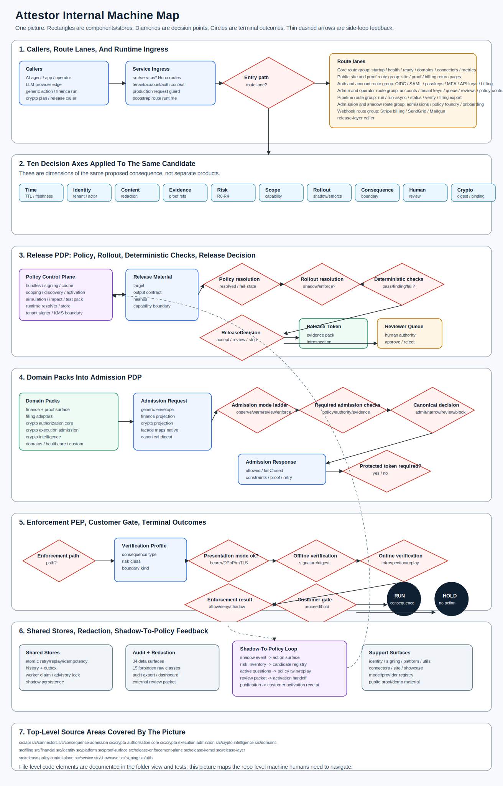

# Attestor Internal Machine Map

Status: engine-level internal map for the current consequence path.

This document shows Attestor as one consequence-control machine. It is complete
for the main engine path: proposed action, admission decision, release
authorization, enforcement verification, customer gate, downstream action or
hold, receipt, and proof packet. It is not a claim that every source file,
deployment control, customer integration, or live production dependency is
shown in the picture.

## Core Shape

```text
AI / workflow proposes an action
  -> strict consequence request
  -> PIP evidence and context inputs
  -> PDP consequence admission decision
  -> admit | narrow | review | block
  -> PAP release authorization only for admit/narrow
  -> PEP release-enforcement verification
  -> customer gate / downstream PEP
  -> real action or nothing happens
  -> receipt and digest-only proof packet
```

The compact decision-space model is:

```text
untrusted action intent
  -> admission PDP
  -> protected release authorization
  -> enforcement PEP
  -> customer gate
  -> downstream consequence or hold
```

## Vocabulary Boundary

Attestor uses the standard access-control separation:

| Term | Meaning in this map | Attestor surface |
| --- | --- | --- |
| PIP | Policy Information Point: policy, evidence, authority, tenant, freshness, no-go, and context inputs. | Evidence refs, authority refs, policy refs, tenant context, replay/idempotency facts. |
| PAP | Policy Administration Point: policy and release administration. | Policy versions, release records, reviewer/signer refs, protected release-token issuance. |
| PDP | Policy Decision Point: evaluates the consequence request and returns a decision. | Consequence Admission Core: `admit`, `narrow`, `review`, `block`. |
| PEP | Policy Enforcement Point: enforces or holds before the real downstream action. | Release Enforcement Verifier plus customer gate / downstream gate. |

This vocabulary is aligned with NIST SP 800-162 and the OASIS XACML
architecture, but Attestor's decisions are consequence-admission decisions,
not a generic access-control product claim.

Source anchors:

- [NIST SP 800-162](https://csrc.nist.gov/pubs/sp/800/162/upd2/final)
- [OASIS XACML 3.0 core specification](https://docs.oasis-open.org/xacml/3.0/xacml-3.0-core-spec-cos01-en.html)

## One-Picture Internal Map

The SVG below is the readable one-picture map. It is intentionally less dense
than the old internal poster so the main consequence path, branches, and
authority boundaries can be understood at once.

Decision points and branch outcomes are shown directly in the flow. Side panels
show PIP inputs, no-claims, and the module groups that feed the path.



[Open full-size SVG](../assets/attestor-internal-machine-map.svg)

## Branching Outcome Rules

| Decision | Release authorization | Enforcement / customer gate | Downstream action |
| --- | --- | --- | --- |
| `admit` | Protected release token may be issued. | Must verify token, introspection, replay, sender, target, tenant, scope, and proof binding. | Executes only if the gate proceeds. |
| `narrow` | Protected release token may be issued for the narrowed scope. | Must verify the narrowed scope and proof binding. | Executes only within the narrowed scope. |
| `review` | No executable release should be treated as authority. | Gate holds. | No action. |
| `block` | No executable release should be treated as authority. | Gate holds or blocks. | No action. |

Protected release authorization cannot rescue a bad request. If the export
intent, tenant, target, action, proof ref, sender binding, online
introspection, replay consumption, or scope binding fails, the PEP/customer
gate holds and the downstream action does not run.

The admission check kinds stay explicit in the map contract: `policy`,
`authority`, `evidence`, `freshness`, `enforcement`, and
`adapter-readiness`.

## Proof Packet Shape

The proof packet is the audit output of the whole path. It should carry
digest-only evidence:

```text
AI action digest
normalized request digest
PDP decision and reason codes
policy version
evidence refs
protected release token id/digest, not raw token
online introspection result
replay consumption result
customer gate decision
downstream receipt refs
redaction scan
no-claims
```

The proof packet must not carry raw prompts, raw provider bodies, raw release
tokens, sender proofs, raw rows, credentials, customer identifiers, private
policy internals, or provider error bodies.

## Main Parts

| Part | Main code | Role in the map |
| --- | --- | --- |
| Model/provider edge | `src/api/*` | Optional upstream source of proposed action intent; model output has no authority by itself. |
| Consequence admission core | `src/consequence-admission/*` | Normalizes and evaluates proposed consequences; emits `admit`, `narrow`, `review`, or `block`. |
| Release kernel/layer | `src/release-kernel/*`, `src/release-layer/*` | Binds accepted decisions to proof, policy version, reviewer/signer references, and release authorization. |
| Policy control plane | `src/release-policy-control-plane/*` | Creates, activates, resolves, and audits policy bundles and policy versions. |
| Release enforcement plane | `src/release-enforcement-plane/*` | Verifies release tokens, sender-bound presentations, online introspection, replay, and downstream binding. |
| Customer gate | `src/consequence-admission/customer-gate.ts` | Last proceed/hold gate before a real downstream consequence. |
| Domain packs | `src/financial/*`, `src/crypto-*/*`, `src/filing/*`, `src/domains/*` | Project domain-specific actions into the same consequence-admission engine. |
| Hosted service/runtime | `src/service/*` | Routes, tenant context, account/admin surfaces, stores, workers, and runtime composition. |
| Signing and proof support | `src/signing/*`, `src/proof-surface/*`, `src/showcase/*` | Verification kits, certificates, proof display, and reviewable proof artifacts. |
| Shadow-to-policy loop | `src/consequence-admission/shadow-*`, `src/consequence-admission/policy-foundry-*`, `src/consequence-admission/action-surface-*` | Review/onboarding side loop; it informs future policy but is not the enforcement edge. |

## Path Notes

### Allowed Path

```text
admit
  -> protected release token
  -> release-enforcement verifier
  -> customer gate proceeds
  -> downstream action executes
  -> receipt + proof packet
```

### Narrowed Path

```text
narrow
  -> protected release token bound to narrowed scope
  -> release-enforcement verifier
  -> customer gate proceeds only for narrowed scope
  -> bounded downstream action executes
  -> receipt + proof packet
```

### Hold Paths

```text
review
  -> no executable downstream authority
  -> customer gate holds
  -> proof explains why no action ran

block
  -> no executable downstream authority
  -> customer gate holds or blocks
  -> proof explains why no action ran
```

### Failure Paths

```text
invalid intent
missing proof
wrong tenant
wrong target or audience
wrong action
stale token
missing sender constraint
missing online introspection
replayed authorization
scope outside allowed bounds
redaction failure
```

Each failure path must hold before the real downstream action, or mark the
artifact as not shareable when the issue is proof-output redaction.

## No-Claims

This map does not prove:

- production readiness;
- enterprise readiness;
- live customer PEP no-bypass;
- live shared replay/introspection stores;
- external KMS/HSM-backed runtime signing;
- customer deployment;
- compliance certification.

Those are separate proof obligations.
