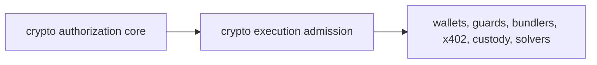

# Crypto Execution Admission Surface

Attestor now exposes the first crypto execution admission layer through:

- `attestor/crypto-execution-admission`

This is the stable packaged surface after `attestor/crypto-authorization-core`. It is complete for the current execution-admission buildout track and remains inside the Attestor modular monolith rather than becoming a separate deployable service.

## Package Boundary, Not Hosted Crypto Runtime

This package is a customer-side integration surface. It is not a public hosted
`/api/v1/crypto/*` route, not a separate crypto runtime, and not a wallet,
custodian, signer, bundler, broadcaster, facilitator, exchange, or settlement
verifier.

A customer adapter or PEP must import the package, run the relevant crypto
authorization preflight, and bind the downstream wallet, Safe, bundler, custody
callback, x402 facilitator, or intent-solver call to the Attestor admission
result. If that downstream path can bypass the customer adapter, Attestor has
not proven a non-bypassable crypto enforcement boundary.

The package can require `attestor-release-authorization`,
`policy-scope-binding`, and `enforcement-presentation` handoff artifacts. It
does not independently prove that arbitrary customer-supplied policy,
authority, evidence, settlement, or receipt references are semantically valid
against a live customer policy/evidence store. The customer adapter must verify
those references against the active bundle, evidence store, chain receipt, or
provider callback before allowing downstream execution.

## Final Package Boundary

The package surface exposes one public subpath and one curated namespace object:

- public subpath: `attestor/crypto-execution-admission`
- namespace object: `cryptoExecutionAdmission`
- surface descriptor: `cryptoExecutionAdmissionPublicSurface()`

This follows the same package-boundary model as the release layer, policy control plane, enforcement plane, and crypto authorization core: consumers import one stable subpath while internal file layout stays private behind `package.json` `exports`.

The public compatibility promise is:

- the subpath name is stable
- namespace names under `cryptoExecutionAdmission` are stable
- versioned admission, handoff, telemetry, receipt, and conformance specs remain the public contract
- internal `attestor/crypto-execution-admission/*.js` deep module paths are not public API

The core answers:

- what is the proposed programmable-money consequence?
- what risk, release decision, policy scope, enforcement binding, and adapter preflight apply?
- is the candidate ready, blocked, or missing evidence?

The admission layer answers:

- which execution surface is involved?
- what artifacts must be handed to that surface?
- what must be blocked?
- what missing evidence must be collected?
- what receipt must be recorded after downstream execution is attempted?

## Public Contract

The public subpath exposes:

- `cryptoExecutionAdmission`
- `cryptoExecutionAdmissionPlanner`
- `cryptoExecutionAdmissionPublicSurface()`
- `createCryptoExecutionAdmissionPlan()`
- `createCryptoAdmissionReceipt()`
- `createCryptoAdmissionTelemetryEvent()`
- `createCryptoAdmissionTelemetrySubject()`
- `createDelegatedEoaAdmissionHandoff()`
- `createErc4337BundlerAdmissionHandoff()`
- `createCustodyPolicyAdmissionCallbackContract()`
- `createIntentSolverAdmissionHandoff()`
- `createModularAccountAdmissionHandoff()`
- `createWalletRpcAdmissionHandoff()`
- `createSafeGuardAdmissionReceipt()`
- `createX402ResourceServerAdmissionMiddleware()`
- `buildCryptoAdmissionTelemetrySummary()`
- `createInMemoryCryptoAdmissionTelemetrySink()`
- `validateCryptoAdmissionConformanceFixtureSuite()`
- `cryptoExecutionAdmissionAdapterProfile()`
- `cryptoExecutionAdmissionDescriptor()`
- `cryptoExecutionAdmissionLabel()`
- `cryptoAdmissionConformanceDescriptor()`
- `cryptoAdmissionTelemetryDescriptor()`
- `cryptoAdmissionTelemetryEventSafetyFindings()`
- `erc4337BundlerAdmissionDescriptor()`
- `erc4337BundlerAdmissionHandoffLabel()`
- `custodyPolicyAdmissionCallbackDescriptor()`
- `custodyPolicyAdmissionCallbackLabel()`
- `delegatedEoaAdmissionDescriptor()`
- `delegatedEoaAdmissionHandoffLabel()`
- `intentSolverAdmissionDescriptor()`
- `intentSolverAdmissionHandoffLabel()`
- `modularAccountAdmissionDescriptor()`
- `modularAccountAdmissionHandoffLabel()`
- `safeGuardAdmissionDescriptor()`
- `safeGuardAdmissionReceiptLabel()`
- `verifyCryptoAdmissionReceipt()`
- `walletRpcAdmissionDescriptor()`
- `walletRpcAdmissionHandoffLabel()`
- `x402ResourceServerAdmissionDescriptor()`
- `x402ResourceServerAdmissionLabel()`
- versioned admission outcomes, surfaces, step kinds, step statuses, telemetry, receipt, conformance fixture, namespace, and extraction-criteria constants

The curated namespace object groups the platform surface as:

| Namespace | Role |
|---|---|
| `planner` | adapter-to-surface planning, outcomes, steps, labels, and descriptors |
| `walletRpc` | EIP-5792 / ERC-7715 / ERC-7902 wallet-call handoffs |
| `safeGuard` | Safe transaction and module guard admission receipts |
| `erc4337Bundler` | ERC-4337 / ERC-7769 bundler handoffs |
| `modularAccount` | ERC-7579 and ERC-6900 runtime handoffs |
| `delegatedEoa` | EIP-7702 delegated EOA handoffs |
| `x402ResourceServer` | x402 resource-server admission middleware contracts |
| `custodyPolicyCallback` | custody/co-signer callback contracts |
| `intentSolver` | intent-solver and ERC-7683-style route handoffs |
| `telemetryReceipts` | uniform telemetry, signed receipts, sinks, summaries, and verification |
| `conformanceFixtures` | JSON fixture/schema descriptors and runtime validation |

The first planner maps existing crypto authorization simulation results onto these surfaces:

| Adapter | Admission surface |
|---|---|
| `safe-guard` | `smart-account-guard` |
| `safe-module-guard` | `smart-account-guard` |
| `erc-4337-user-operation` | `account-abstraction-bundler` |
| `erc-7579-module` | `modular-account-runtime` |
| `erc-6900-plugin` | `modular-account-runtime` |
| `eip-7702-delegation` | `delegated-eoa-runtime` |
| `wallet-call-api` | `wallet-rpc` |
| `x402-payment` | `agent-payment-http` |
| `custody-cosigner` | `custody-policy-engine` |
| `intent-settlement` | `intent-solver` |

The wallet RPC handoff maps a wallet-ready admission plan into:

| Standard | Handoff role |
|---|---|
| EIP-5792 | capability discovery, `wallet_sendCalls`, call status tracking, and atomic execution expectations |
| ERC-7715 | execution-permission request construction, supported-permission discovery, rule validation, and permission next actions |
| ERC-7902 | account-abstraction capability expectations such as `eip7702Auth`, validity windows, paymaster configuration, multidimensional nonce, and gas override support |

The handoff deliberately keeps Attestor outside the wallet role. It creates JSON-RPC request objects and an optional `attestorAdmission` sidecar capability for compatible wallets, but the admission receipt and policy proof remain Attestor artifacts.

Safe guard admission receipts map Safe pre/post hook evidence into durable Attestor receipts:

| Safe surface | Receipt role |
|---|---|
| Transaction guard | Binds `checkTransaction` / `checkAfterExecution`, Safe transaction hash, guard interface support, and owner recovery posture |
| Module guard | Binds `checkModuleTransaction` / `checkAfterModuleExecution`, module transaction hash, module address, module-guard interface support, and module disablement recovery |

The receipt does not deploy or replace a Safe guard. It proves that the Safe guard path was admitted by Attestor, names the required interface id, carries the canonical preflight digest, and fails closed if the guard is not enabled, lacks ERC-165/interface support, mismatches the admitted Safe, or cannot be recovered by owners.

ERC-4337 bundler admission handoffs map UserOperation preflight evidence into ERC-7769 JSON-RPC requests:

| Bundler method | Handoff role |
|---|---|
| `eth_chainId` | Confirm the bundler endpoint is serving the admitted EIP-155 chain |
| `eth_supportedEntryPoints` | Confirm the admitted EntryPoint is accepted by the bundler |
| `eth_estimateUserOperationGas` | Collect gas evidence before submission and block under-provisioned UserOperations |
| `eth_sendUserOperation` | Submit only after Attestor admission, EntryPoint support, ERC-7562 posture, and gas fit are satisfied |
| `eth_getUserOperationByHash` / `eth_getUserOperationReceipt` | Track inclusion and persist the downstream result against the Attestor handoff |

The handoff does not become a bundler or paymaster. It packages the UserOperation, EntryPoint, chain, gas estimate, ERC-7562 validation-scope expectation, paymaster posture, and Attestor sidecar into a deterministic pre-submission object.

Modular account admission handoffs map ERC-7579 module and ERC-6900 plugin preflight evidence into runtime admission receipts:

| Runtime surface | Handoff role |
|---|---|
| ERC-7579 module runtime | Bind account, module type id, installed module evidence, execution mode support, selector scope, hook pre/post evidence, recovery posture, and runtime checks such as `supportsExecutionMode` and `isModuleInstalled` |
| ERC-6900 plugin runtime | Bind plugin address, execution manifest hash, runtime validation, selector-scoped execution, execution hooks, dependencies, recovery posture, and post-execution runtime observations |

The handoff does not install modules, run hooks, or execute plugin calls. It records the exact module/plugin path that Attestor admitted and fails closed on wrong plan surface, blocked preflight, hook failure, manifest gaps, recovery gaps, chain/account mismatch, or failed runtime observation.

Delegated EOA admission handoffs map EIP-7702 delegation preflight evidence into delegated-runtime handoffs:

| Runtime surface | Handoff role |
|---|---|
| EIP-7702 direct set-code transaction | Bind authorization tuple evidence, authority nonce state, account code posture, delegate implementation posture, signed target/value/gas/nonce scope, initialization posture, recovery posture, and post-execution observation before a type `0x04` transaction is submitted |
| EIP-5792 / ERC-7902 delegated wallet path | Bind `eip7702Auth` capability support, atomic wallet-call expectations, and the same tuple/delegate/nonce controls before wallet-assisted delegated execution is requested |
| ERC-4337 delegated EOA path | Bind `eip7702Auth` inclusion, `0x7702` initcode-marker posture, EntryPoint evidence, preVerificationGas authorization coverage, and delegated-EOA-specific runtime observations before bundler submission proceeds |

The handoff does not become a wallet, relayer, or delegated account implementation. It proves that the delegated-EOA execution path Attestor admitted still has the required tuple, delegate, nonce, wallet/runtime capability, initialization, sponsorship, and recovery posture before value-moving execution is attempted.

x402 resource-server admission middleware maps x402 payment preflight evidence into a fail-closed HTTP fulfillment contract:

| Middleware phase | Admission role |
|---|---|
| `payment-challenge` | Require HTTP `402 Payment Required` with `PAYMENT-REQUIRED` and block fulfillment until a valid retry path exists |
| `payment-retry` | Require `PAYMENT-SIGNATURE`, facilitator `/verify`, facilitator `/settle`, payment-identifier posture, and `PAYMENT-RESPONSE` binding before any paid response may be returned |
| `resource-fulfillment` | Allow fulfillment only after settlement succeeds, duplicate payment posture stays clean, and the paid response remains bound to Attestor admission evidence |

The middleware does not become the x402 resource server or facilitator. It gives the resource server a deterministic Attestor contract for when to challenge, when to verify, when to settle, when to fulfill, and when to fail closed.

Custody policy admission callback contracts map custody/co-signer callback evidence into explicit provider responses:

| Callback surface | Admission role |
|---|---|
| Synchronous co-signer callback | Require configured callback handling, authenticated request/response posture, fresh nonce/body binding, response deadline fit, and signed or pinned-channel response semantics before returning provider approval |
| Approval queue / provider review | Normalize pending approval, missing quorum, break-glass, travel-rule, or retry posture into `needs-review` without allowing custody signing to proceed |
| Policy consensus engine | Bind provider policy decision, explicit/implicit deny handling, approval quorum, and Attestor token evidence before allowing a custody signing path |

The contract does not become a custody platform, key manager, MPC signer, or provider webhook endpoint. It shapes the provider callback result into Attestor `allow`, `needs-review`, or `deny` and fails closed on missing callback configuration, weak authentication, stale callback bodies, policy deny, sanctions/risk hits, velocity breaches, unsafe key posture, or failed provider terminal status.

Intent-solver admission handoffs map solver route evidence into deterministic pre-execution contracts:

| Solver surface | Admission role |
|---|---|
| ERC-7683 gasless order | Bind user-signed order evidence, `openFor`/origin-settler posture, nonce freshness, route commitment, fill instructions, and settlement windows before a filler opens the order |
| ERC-7683 on-chain order | Bind `open` order evidence, destination settler instructions, route/slippage commitments, counterparty posture, and replay checks before the order is submitted |
| Solver API / custom intent route | Bind quote expiry, route simulation, counterparties, settlement security review, liquidity/refund posture, and Attestor sidecar evidence before handing execution to a solver network |

The handoff does not become a solver, bridge, relayer, orderbook, or settlement contract. It proves that the solver route Attestor admitted still matches the policy-bound order, slippage bounds, counterparties, settlement contracts, deadlines, and replay posture before an intent route can be opened, filled, or broadcast.

Admission telemetry and receipts provide one uniform observability and proof shape across all crypto execution surfaces:

| Output | Role |
|---|---|
| Telemetry event | CloudEvents-style envelope with OpenTelemetry-compatible severity/attributes, W3C `traceparent` / `tracestate` correlation, surface, plan, subject, signal, and failure reasons |
| Admission receipt | HMAC-SHA256 signed Attestor receipt binding the admission plan, subject handoff, evidence digest, trace context, classification, and failure reasons |
| Summary / sink | In-memory sink and summary helpers for tests, local operators, and integration harnesses to count admitted, blocked, missing-evidence, and receipt-issued events by surface |

The telemetry layer does not replace an observability backend, SIEM, tracing collector, or transparency log. It emits stable Attestor objects that those systems can carry, index, verify, or archive.

Conformance fixtures give external integrators a stable JSON contract to test against:

| Fixture surface | Role |
|---|---|
| JSON fixture suite | `fixtures/crypto-execution-admission/conformance-fixtures.v1.json` covers wallet RPC, smart-account guard, ERC-4337 bundler, modular-account runtime, delegated-EOA runtime, x402 resource server, custody policy engine, and intent solver paths |
| JSON Schema | `fixtures/crypto-execution-admission/conformance-fixtures.schema.json` documents the Draft 2020-12 structural shape for the suite |
| Runtime validator | `validateCryptoAdmissionConformanceFixtureSuite()` checks surface coverage, plan/subject/telemetry/receipt binding, fail-closed assertions, and fixture-signed receipt verification |

The fixture signer is intentionally marked `fixture-only`. It is a deterministic test vector so wallets, guards, bundlers, payment servers, custody engines, and solvers can prove they preserve Attestor plan, telemetry, and receipt bindings. It is not a production signing key or custody credential.

## Extraction Criteria

The execution-admission package surface is ready before standalone service extraction. Full service extraction still requires one criterion to become true:

1. Stable admission plan contract. Status: `ready`
2. External integration surfaces proven. Status: `ready`
3. Telemetry, receipt, and conformance proof surface proven. Status: `ready`
4. Package boundary proven by export-map probes. Status: `ready`
5. Low-latency chain adjacency, customer-operated custody boundaries, or separate isolation requirements justify a standalone service. Status: `pending`

So crypto execution admission is now **packaged**, but not yet **split into a separate service**.

## Why It Is Separate From The Core

The crypto authorization core must stay stable and adapter-neutral. Execution admission is closer to integration surfaces. It is allowed to know that an x402 handoff needs `PAYMENT-REQUIRED`, `PAYMENT-SIGNATURE`, and `PAYMENT-RESPONSE`, or that ERC-4337 admission must carry bundler simulation evidence.

That keeps the dependency direction clean:



## Consumption Example

```ts
import {
  cryptoExecutionAdmission,
  cryptoExecutionAdmissionPublicSurface,
  createCryptoExecutionAdmissionPlan,
  createCryptoAdmissionReceipt,
  createCryptoAdmissionTelemetryEvent,
  createCryptoAdmissionTelemetrySubject,
  validateCryptoAdmissionConformanceFixtureSuite,
  createDelegatedEoaAdmissionHandoff,
  createErc4337BundlerAdmissionHandoff,
  createCustodyPolicyAdmissionCallbackContract,
  createIntentSolverAdmissionHandoff,
  createModularAccountAdmissionHandoff,
  createSafeGuardAdmissionReceipt,
  createWalletRpcAdmissionHandoff,
  createX402ResourceServerAdmissionMiddleware,
  verifyCryptoAdmissionReceipt,
} from 'attestor/crypto-execution-admission';

const surface = cryptoExecutionAdmissionPublicSurface();

if (!surface.namespaceExports.includes('walletRpc')) {
  throw new Error('Crypto execution admission wallet namespace is unavailable.');
}

const walletPlan = createCryptoExecutionAdmissionPlan({
  simulation,
  createdAt: new Date().toISOString(),
  integrationRef: 'integration:wallet-rpc:treasury',
});

if (walletPlan.outcome === 'deny') {
  throw new Error(walletPlan.blockedReasons.join(', '));
}

const walletHandoff = createWalletRpcAdmissionHandoff({
  plan: walletPlan,
  createdAt: new Date().toISOString(),
  calls: [
    {
      to: '0x2222222222222222222222222222222222222222',
      data: '0x1234',
    },
  ],
});

if (walletHandoff.outcome === 'blocked') {
  throw new Error(walletHandoff.blockingReasons.join(', '));
}

const delegatedPlan = createCryptoExecutionAdmissionPlan({
  simulation: delegatedEoaSimulation,
  createdAt: new Date().toISOString(),
  integrationRef: 'integration:eip7702:runtime',
});

const delegatedHandoff = createDelegatedEoaAdmissionHandoff({
  plan: delegatedPlan,
  preflight: delegatedEoaPreflight,
  authorization: delegatedAuthorizationTuple,
  accountState: delegatedAuthorityState,
  delegateCode: delegatedCodeEvidence,
  execution: delegatedExecutionEvidence,
  initialization: delegatedInitializationEvidence,
  sponsor: delegatedSponsorEvidence,
  recovery: delegatedRecoveryEvidence,
  createdAt: new Date().toISOString(),
});

if (delegatedHandoff.outcome === 'blocked') {
  throw new Error(delegatedHandoff.blockingReasons.join(', '));
}

const safePlan = createCryptoExecutionAdmissionPlan({
  simulation: safeGuardSimulation,
  createdAt: new Date().toISOString(),
  integrationRef: 'integration:safe-guard:treasury',
});

const safeReceipt = createSafeGuardAdmissionReceipt({
  plan: safePlan,
  preflight: safeGuardPreflight,
  createdAt: new Date().toISOString(),
  installation: {
    guardAddress: '0x4444444444444444444444444444444444444444',
    supportsErc165: true,
    supportsGuardInterface: true,
    enabledOnSafe: true,
  },
  recovery: {
    guardCanBeRemovedByOwners: true,
    emergencySafeTxPrepared: true,
  },
});

if (safeReceipt.outcome === 'blocked') {
  throw new Error(safeReceipt.blockingReasons.join(', '));
}

const bundlerPlan = createCryptoExecutionAdmissionPlan({
  simulation: erc4337Simulation,
  createdAt: new Date().toISOString(),
  integrationRef: 'integration:erc4337:bundler',
});

const bundlerHandoff = createErc4337BundlerAdmissionHandoff({
  plan: bundlerPlan,
  preflight: erc4337Preflight,
  userOperation,
  createdAt: new Date().toISOString(),
});

if (bundlerHandoff.outcome === 'blocked') {
  throw new Error(bundlerHandoff.blockingReasons.join(', '));
}

const modularPlan = createCryptoExecutionAdmissionPlan({
  simulation: modularAccountSimulation,
  createdAt: new Date().toISOString(),
  integrationRef: 'integration:modular-account:treasury',
});

const modularHandoff = createModularAccountAdmissionHandoff({
  plan: modularPlan,
  preflight: modularAccountPreflight,
  createdAt: new Date().toISOString(),
});

if (modularHandoff.outcome === 'blocked') {
  throw new Error(modularHandoff.blockingReasons.join(', '));
}

const x402Plan = createCryptoExecutionAdmissionPlan({
  simulation: x402Simulation,
  createdAt: new Date().toISOString(),
  integrationRef: 'integration:x402:resource-server',
});

const x402Middleware = createX402ResourceServerAdmissionMiddleware({
  plan: x402Plan,
  preflight: x402Preflight,
  resource: x402Resource,
  paymentRequirements: x402Requirements,
  paymentPayload: x402Payload,
  facilitator: x402Facilitator,
  budget: x402Budget,
  serviceTrust: x402ServiceTrust,
  privacy: x402Privacy,
  phase: 'payment-retry',
  createdAt: new Date().toISOString(),
});

if (x402Middleware.outcome === 'blocked') {
  throw new Error(x402Middleware.blockingReasons.join(', '));
}

const custodyPlan = createCryptoExecutionAdmissionPlan({
  simulation: custodySimulation,
  createdAt: new Date().toISOString(),
  integrationRef: 'integration:custody:cosigner',
});

const custodyCallback = createCustodyPolicyAdmissionCallbackContract({
  plan: custodyPlan,
  preflight: custodyPreflight,
  account: custodyAccount,
  transaction: custodyTransaction,
  policyDecision: custodyPolicyDecision,
  approvals: custodyApprovals,
  callback: custodyCosignerCallback,
  screening: custodyScreening,
  keyPosture: custodyKeyPosture,
  postExecution: custodyPostExecution,
  createdAt: new Date().toISOString(),
});

if (custodyCallback.outcome === 'deny') {
  throw new Error(custodyCallback.blockingReasons.join(', '));
}

const intentSolverPlan = createCryptoExecutionAdmissionPlan({
  simulation: intentSettlementSimulation,
  createdAt: new Date().toISOString(),
  integrationRef: 'integration:intent-solver:erc7683',
});

const intentSolverHandoff = createIntentSolverAdmissionHandoff({
  plan: intentSolverPlan,
  order: erc7683OrderEvidence,
  route: solverRouteCommitment,
  settlement: settlementEvidence,
  counterparty: counterpartyEvidence,
  replay: replayEvidence,
  createdAt: new Date().toISOString(),
});

if (intentSolverHandoff.outcome === 'blocked') {
  throw new Error(intentSolverHandoff.blockingReasons.join(', '));
}

const telemetrySubject = createCryptoAdmissionTelemetrySubject({
  plan: intentSolverPlan,
  subjectKind: 'intent-solver-handoff',
  subjectId: intentSolverHandoff.handoffId,
  subjectDigest: intentSolverHandoff.digest,
  outcome: intentSolverHandoff.outcome,
  action: intentSolverHandoff.action,
});

const admissionReceipt = createCryptoAdmissionReceipt({
  plan: intentSolverPlan,
  subject: telemetrySubject,
  issuedAt: new Date().toISOString(),
  serviceId: 'attestor-crypto-admission',
  signer: {
    keyId: 'customer-operated-admission-key',
    secret: process.env.ATTESTOR_CRYPTO_ADMISSION_RECEIPT_KEY!,
  },
});

const telemetryEvent = createCryptoAdmissionTelemetryEvent({
  source: 'attestor.crypto-execution-admission',
  observedAt: new Date().toISOString(),
  plan: intentSolverPlan,
  subject: telemetrySubject,
  receipt: admissionReceipt,
});

const receiptVerification = verifyCryptoAdmissionReceipt({
  receipt: admissionReceipt,
  signer: {
    keyId: 'customer-operated-admission-key',
    secret: process.env.ATTESTOR_CRYPTO_ADMISSION_RECEIPT_KEY!,
  },
});

if (receiptVerification.status !== 'valid') {
  throw new Error(receiptVerification.failureReasons.join(', '));
}

const conformance = validateCryptoAdmissionConformanceFixtureSuite(fixtureSuiteJson);

if (conformance.status !== 'valid') {
  throw new Error(conformance.findings.map((finding) => finding.message).join(', '));
}

const walletMethods = cryptoExecutionAdmission.walletRpc
  .walletRpcAdmissionDescriptor()
  .methods;

if (!walletMethods.includes('wallet_sendCalls')) {
  throw new Error('Wallet RPC admission surface is not packaged correctly.');
}
```

## What Stays Internal

These paths are not public package API:

- `attestor/crypto-execution-admission/*.js`
- `attestor/crypto-authorization-core/*.js`
- service runtime internals

The package subpath is intentionally narrow so the admission layer can grow without freezing every internal file.
