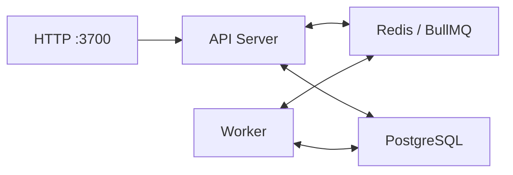

# Deployment

For the end-to-end rollout path, including the recommended GKE/Google Secret Manager/External Secrets production route, see [Production readiness guide](production-readiness.md).

Attestor runs as two separate processes sharing Redis and PostgreSQL:

- **API server** - HTTP endpoints for pipeline execution, verification, filing
- **Pipeline worker** - BullMQ consumer that processes async governed pipeline jobs

Both processes are built from the same container image with different `CMD` arguments.

## Service Topology



## Local Development

```bash
# Single-process (API + embedded worker + embedded Redis)
npm run serve

# Split processes (requires external Redis)
REDIS_URL=redis://localhost:6379 npm run serve &
REDIS_URL=redis://localhost:6379 npm run worker &
```

## Docker Compose

```bash
docker compose up
```

Starts 4 services: `api`, `worker`, `postgres`, `redis`.

- API healthcheck uses `/api/v1/ready` (returns 503 until backend ready)
- Worker auto-restarts on crash (`restart: unless-stopped`)
- PostgreSQL RLS auto-activated on API startup when `ATTESTOR_PG_URL` is set

The HA compose topology is a rehearsal pattern and requires explicit database credentials:

```bash
ATTESTOR_DB_USER=attestor \
ATTESTOR_DB_PASSWORD="$(openssl rand -base64 32)" \
ATTESTOR_DB_NAME=attestor \
docker compose -f docker-compose.ha.yml up
```

## Container

```bash
# Build
docker build -t attestor .

# Run API
docker run -p 3700:3700 \
  -e REDIS_URL=redis://redis:6379 \
  -e ATTESTOR_PG_URL=postgresql://... \
  attestor

# Run Worker (same image, different command)
docker run \
  -e REDIS_URL=redis://redis:6379 \
  attestor node dist/service/worker.js
```

## Environment Variables

| Variable | Required | Default | Description |
|---|---|---|---|
| `PORT` | No | `3700` | API listen port |
| `REDIS_URL` | No | Auto-resolved | Redis connection URL (Tier 1 of 3-tier resolution) |
| `ATTESTOR_PG_URL` | No | None | PostgreSQL for RLS tenant isolation |
| `SNOWFLAKE_ALLOWED_SCHEMAS` | No | None | Optional comma-separated Snowflake schema allowlist. When set, Snowflake connector queries must use schema-qualified or database.schema-qualified table references in the allowlist |
| `SNOWFLAKE_TIMEOUT_MS` | No | `30000` | Snowflake connector client-side query timeout in milliseconds |
| `ATTESTOR_TENANT_KEYS` | No | `""` | API key to tenant-id mapping (`key:id:name[:plan][:quota],...`). Empty keys allow anonymous `default` tenant only in local development; production-like runtimes (`NODE_ENV=production`, `ATTESTOR_HA_MODE`, public hostname/base URL) reject anonymous tenant fallback on non-public routes |
| `ATTESTOR_ALLOWED_HOSTS` | No | None | Optional comma-separated HTTP Host allowlist. In production-like runtimes, this is combined with `ATTESTOR_PUBLIC_HOSTNAME` and `ATTESTOR_PUBLIC_BASE_URL` hostnames and rejects non-matching Host headers |
| `ATTESTOR_TRUST_PROXY_HEADERS` | No | `false` | Enables trusted proxy header processing for source IP resolution. Only enable when the direct peer is a trusted proxy that overwrites or strips inbound forwarded headers |
| `ATTESTOR_TRUSTED_PROXY_PEER_IPS` | No | None | Comma-separated direct proxy peer IP allowlist for trusted forwarded headers. Wildcard `*` is blocked in production-like runtimes unless explicitly overridden |
| `ATTESTOR_TRUSTED_PROXY_HOPS` | No | `1` | Trusted reverse-proxy hop count used to select `X-Forwarded-For` / RFC 7239 `Forwarded` addresses from the right side of the chain |
| `ATTESTOR_TRUSTED_PROXY_PEER_WILDCARD_OVERRIDE` | No | None | Production-like escape hatch for `ATTESTOR_TRUSTED_PROXY_PEER_IPS=*`; must be exactly `accept-the-risk` |
| `ATTESTOR_AUTH_RATE_LIMIT_WINDOW_SECONDS` | No | `300` | Hosted password-login abuse guard window in seconds |
| `ATTESTOR_AUTH_RATE_LIMIT_MAX_FAILURES_PER_EMAIL` | No | `5` | Failed password-login attempts per normalized email before temporary lockout |
| `ATTESTOR_AUTH_RATE_LIMIT_MAX_FAILURES_PER_SOURCE` | No | `20` | Failed password-login attempts per client source before temporary lockout |
| `ATTESTOR_AUTH_RATE_LIMIT_LOCKOUT_SECONDS` | No | `300` | Temporary login lockout duration after auth abuse guard threshold is reached |
| `ATTESTOR_RELEASE_RUNTIME_PKI_PATH` | No | `.attestor/release-runtime-pki.json` for non-local profiles | File-backed release issuer PKI store. `single-node-durable` and `production-shared` load or create this store so release-token verification keys survive runtime restart |
| `ATTESTOR_RELEASE_RUNTIME_PKI_SHARED_PATH` | No | `false` | Required as `true` when HA/shared-path enforcement is active. It is an operator attestation that `ATTESTOR_RELEASE_RUNTIME_PKI_PATH` is backed by storage shared across every serving instance, not by per-pod local filesystem |
| `ATTESTOR_RELEASE_RUNTIME_PKI_REQUIRE_SHARED_PATH` | No | `false` | Explicitly requires shared release-runtime PKI path enforcement outside `ATTESTOR_HA_MODE`. Useful for rehearsal of multi-instance release-token verification |
| `ATTESTOR_RELEASE_RUNTIME_PKI_ROTATION_ID` | No | None | Explicit release issuer rotation marker. Changing this value in a file-backed runtime creates a new active signer and retains the previous public verification key in the JWKS rollover set; this is local/file-backed key lifecycle support, not a KMS/HSM rotation service |
| `ATTESTOR_RELEASE_SIGNING_PROVIDER` | No | Derived from PKI mode | Release signer provider declaration. Supported values are `runtime-ephemeral`, `file-pem`, and `external-kms`. `external-kms` intentionally fails closed until a real KMS/HSM-backed signer is implemented, so operators cannot accidentally declare KMS while the runtime signs with local PEM material |
| `ATTESTOR_REQUIRE_PRODUCTION_RELEASE_SIGNING_PROVIDER` | No | `false` | Promotion gate. When `true`, bootstrap refuses local runtime signing material and requires a supported external KMS/HSM provider. This is for production promotion rehearsal, not local evaluation |
| `ATTESTOR_ACCOUNT_STORE_PATH` | No | `.attestor/accounts.json` | File-backed hosted account registry used when `ATTESTOR_CONTROL_PLANE_PG_URL` is not configured |
| `ATTESTOR_ACCOUNT_USER_STORE_PATH` | No | `.attestor/account-users.json` | File-backed hosted account user registry used when `ATTESTOR_CONTROL_PLANE_PG_URL` is not configured |
| `ATTESTOR_ACCOUNT_SESSION_STORE_PATH` | No | `.attestor/account-sessions.json` | File-backed hosted customer session store used when `ATTESTOR_CONTROL_PLANE_PG_URL` is not configured |
| `ATTESTOR_ACCOUNT_USER_TOKEN_STORE_PATH` | No | `.attestor/account-user-tokens.json` | File-backed hosted invite/password-reset/MFA-login token store used when `ATTESTOR_CONTROL_PLANE_PG_URL` is not configured |
| `ATTESTOR_ACCOUNT_SAML_REPLAY_STORE_PATH` | No | `.attestor/account-saml-replays.json` | File-backed hosted SAML replay-consumption ledger used when `ATTESTOR_CONTROL_PLANE_PG_URL` is not configured |
| `ATTESTOR_TENANT_KEY_STORE_PATH` | No | `.attestor/tenant-keys.json` | File-backed tenant key store used by `npm run tenant:keys` and API key lookup when `ATTESTOR_CONTROL_PLANE_PG_URL` is not configured |
| `ATTESTOR_TENANT_KEY_MAX_ACTIVE_PER_TENANT` | No | `2` | Max simultaneously active hosted API keys per tenant during rotation overlap |
| `ATTESTOR_SECRET_ENVELOPE_PROVIDER` | No | None | Optional hosted secret-envelope provider for sealed tenant-key recovery (`vault_transit`) |
| `ATTESTOR_TENANT_KEY_RECOVERY_ENABLED` | No | `false` | Enables audited break-glass tenant-key recovery when a secret-envelope provider is configured |
| `ATTESTOR_VAULT_TRANSIT_BASE_URL` | No | None | Vault Transit base URL used when `ATTESTOR_SECRET_ENVELOPE_PROVIDER=vault_transit`. Production-like runtimes require `https://` unless the URL targets localhost |
| `ATTESTOR_VAULT_TRANSIT_TOKEN` | No | None | Vault token used for tenant-key recovery envelope seal/unseal requests |
| `ATTESTOR_VAULT_TRANSIT_KEY_NAME` | No | None | Vault Transit key name used for hosted tenant-key recovery envelopes |
| `ATTESTOR_VAULT_TRANSIT_MOUNT_PATH` | No | `transit` | Vault Transit mount path override |
| `ATTESTOR_VAULT_TRANSIT_TIMEOUT_MS` | No | `30000` | Vault Transit seal/unseal request timeout in milliseconds |
| `ATTESTOR_VAULT_NAMESPACE` | No | None | Optional Vault namespace header for enterprise Vault deployments |
| `ATTESTOR_USAGE_LEDGER_PATH` | No | `.attestor/usage-ledger.json` | File-backed single-node usage ledger for hosted quota enforcement when `ATTESTOR_CONTROL_PLANE_PG_URL` is not configured |
| `ATTESTOR_BILLING_ENTITLEMENT_STORE_PATH` | No | `.attestor/billing-entitlements.json` | File-backed hosted billing entitlement read model used when `ATTESTOR_CONTROL_PLANE_PG_URL` is not configured |
| `ATTESTOR_SESSION_COOKIE_NAME` | No | `attestor_session` | Hosted customer session cookie name |
| `ATTESTOR_SESSION_TTL_HOURS` | No | `12` | Hosted customer session TTL in hours |
| `ATTESTOR_SESSION_IDLE_TIMEOUT_MINUTES` | No | `30` | Hosted customer session idle timeout in minutes |
| `ATTESTOR_SESSION_COOKIE_SECURE` | No | `false` | Mark hosted customer session cookies as `Secure` |
| `ATTESTOR_EMAIL_DELIVERY_MODE` | No | `manual` | Hosted invite/reset delivery mode: `manual` or `smtp` |
| `ATTESTOR_EMAIL_PROVIDER` | No | `smtp` | Optional hosted SMTP provider hint; `sendgrid_smtp` adds SendGrid SMTP unique args, `mailgun_smtp` adds Mailgun variables, and both enable signed provider webhook analytics |
| `ATTESTOR_EMAIL_FROM` | No | None | Sender address used for hosted SMTP invite/reset delivery |
| `ATTESTOR_EMAIL_REPLY_TO` | No | None | Optional reply-to address for hosted SMTP invite/reset delivery |
| `ATTESTOR_SMTP_URL` | No | None | Optional SMTP connection URL for hosted invite/reset delivery |
| `ATTESTOR_SMTP_HOST` | No | None | SMTP host for hosted invite/reset delivery when `ATTESTOR_SMTP_URL` is not set |
| `ATTESTOR_SMTP_PORT` | No | None | SMTP port for hosted invite/reset delivery when `ATTESTOR_SMTP_URL` is not set |
| `ATTESTOR_SMTP_USER` | No | None | Optional SMTP username |
| `ATTESTOR_SMTP_PASS` | No | None | Optional SMTP password |
| `ATTESTOR_SMTP_SECURE` | No | `false` | Enable SMTPS for hosted invite/reset delivery |
| `ATTESTOR_SMTP_IGNORE_TLS` | No | `false` | Skip STARTTLS for local/test SMTP delivery only; public hosted readiness fails closed when SMTP delivery enables this |
| `ATTESTOR_EMAIL_DELIVERY_EVENTS_PATH` | No | `.attestor/email-delivery-events.json` | File-backed hosted email-delivery event ledger used when `ATTESTOR_CONTROL_PLANE_PG_URL` is not configured |
| `ATTESTOR_EMAIL_WEBHOOK_REQUIRE_SHARED_STORE` | No | `false` | When true, SendGrid/Mailgun provider webhooks refuse file-backed event storage and require `ATTESTOR_CONTROL_PLANE_PG_URL`; `ATTESTOR_HA_MODE=true` enforces the same gate |
| `ATTESTOR_SENDGRID_EVENT_WEBHOOK_PUBLIC_KEY` | No | None | SendGrid Event Webhook public key enabling signed delivery analytics at `POST /api/v1/email/sendgrid/webhook` |
| `ATTESTOR_SENDGRID_EVENT_WEBHOOK_MAX_AGE_SECONDS` | No | `300` | Max webhook timestamp age in seconds for SendGrid signature verification |
| `ATTESTOR_MAILGUN_WEBHOOK_SIGNING_KEY` | No | None | Mailgun webhook signing key enabling signed delivery analytics at `POST /api/v1/email/mailgun/webhook`; Mailgun replay protection stores only a keyed digest of the signature token |
| `ATTESTOR_MAILGUN_WEBHOOK_MAX_AGE_SECONDS` | No | `300` | Max webhook timestamp age in seconds for Mailgun signature verification |
| `ATTESTOR_ACCOUNT_INVITE_BASE_URL` | No | None | Optional hosted invite URL base; Attestor appends `?token=...` for the email body, while delivery ledgers/API summaries redact the bearer token |
| `ATTESTOR_PASSWORD_RESET_BASE_URL` | No | None | Optional hosted password-reset URL base; Attestor appends `?token=...` for the email body, while delivery ledgers/API summaries redact the bearer token |
| `ATTESTOR_WEBAUTHN_RP_ID` | No | Request hostname | Optional RP ID override for hosted WebAuthn/passkey ceremonies |
| `ATTESTOR_WEBAUTHN_ORIGIN` | No | Request origin | Optional origin override for hosted WebAuthn/passkey ceremonies |
| `ATTESTOR_WEBAUTHN_RP_NAME` | No | `Attestor` | Hosted WebAuthn/passkey relying-party display name |
| `ATTESTOR_WEBAUTHN_REQUIRE_USER_VERIFICATION` | No | `false` | When `true`, hosted passkey registration/authentication upgrades from the SimpleWebAuthn passkeys baseline (`preferred`/`false`) to strict UV enforcement (`required`/`true`) |
| `ATTESTOR_WEBAUTHN_STATE_TTL_MINUTES` | No | `10` | Hosted passkey challenge TTL in minutes |
| `ATTESTOR_ACCOUNT_INVITE_TTL_HOURS` | No | `72` | Hosted invite token TTL in hours |
| `ATTESTOR_PASSWORD_RESET_TTL_MINUTES` | No | `30` | Hosted password-reset token TTL in minutes |
| `ATTESTOR_ACCOUNT_MFA_ENCRYPTION_KEY` | No | None | Dedicated secret for encrypting hosted TOTP seeds at rest; falls back to `ATTESTOR_ADMIN_API_KEY` when unset |
| `ATTESTOR_MFA_ISSUER` | No | `Attestor` | Issuer label embedded into generated `otpauth://` TOTP enrollment URLs |
| `ATTESTOR_MFA_LOGIN_TTL_MINUTES` | No | `10` | Hosted MFA login challenge TTL in minutes |
| `ATTESTOR_MFA_LOGIN_MAX_ATTEMPTS` | No | `5` | Max invalid attempts before a hosted MFA login challenge is revoked |
| `ATTESTOR_HOSTED_OIDC_ISSUER_URL` | No | None | Hosted customer OIDC issuer URL enabling the SSO first slice |
| `ATTESTOR_HOSTED_OIDC_CLIENT_ID` | No | None | Hosted customer OIDC client id |
| `ATTESTOR_HOSTED_OIDC_CLIENT_SECRET` | No | None | Hosted customer OIDC client secret |
| `ATTESTOR_HOSTED_OIDC_REDIRECT_URL` | No | None | Hosted customer OIDC callback URL override; defaults from the incoming request origin when omitted |
| `ATTESTOR_HOSTED_OIDC_SCOPES` | No | `openid email profile` | Hosted customer OIDC scopes |
| `ATTESTOR_HOSTED_OIDC_STATE_KEY` | No | None | Dedicated secret for sealing stateless hosted OIDC login state; falls back to `ATTESTOR_ADMIN_API_KEY` |
| `ATTESTOR_HOSTED_OIDC_STATE_TTL_MINUTES` | No | `10` | Hosted customer OIDC login-state TTL in minutes |
| `ATTESTOR_HOSTED_OIDC_ALLOW_INSECURE_HTTP` | No | `false` | Localhost/test-only escape hatch allowing non-HTTPS hosted OIDC issuers |
| `ATTESTOR_HOSTED_OIDC_ALLOW_UNVERIFIED_EMAIL_LINK` | No | None | Set to `accept-the-risk` only if automatic first-link fallback may trust OIDC emails without `email_verified=true`; default is fail-closed |
| `ATTESTOR_HOSTED_SAML_IDP_METADATA_XML` | No | None | Inline IdP metadata XML enabling hosted SAML SSO first slice |
| `ATTESTOR_HOSTED_SAML_IDP_METADATA_PATH` | No | None | Filesystem path to IdP metadata XML enabling hosted SAML SSO first slice |
| `ATTESTOR_HOSTED_SAML_ENTITY_ID` | No | Metadata URL | Hosted SAML SP entity ID override |
| `ATTESTOR_HOSTED_SAML_METADATA_URL` | No | Request-origin derived | Hosted SAML metadata URL override |
| `ATTESTOR_HOSTED_SAML_ACS_URL` | No | Request-origin derived | Hosted SAML ACS URL override |
| `ATTESTOR_HOSTED_SAML_RELAY_STATE_KEY` | No | None | Dedicated secret for sealing stateless hosted SAML relay state; falls back to `ATTESTOR_ADMIN_API_KEY` |
| `ATTESTOR_HOSTED_SAML_RELAY_STATE_TTL_MINUTES` | No | `10` | Hosted SAML relay-state TTL in minutes |
| `ATTESTOR_HOSTED_SAML_CLOCK_DRIFT_SECONDS` | No | `120` | Hosted SAML clock-skew tolerance in seconds for response time windows |
| `ATTESTOR_HOSTED_SAML_SIGN_AUTHN_REQUESTS` | No | `false` | When `true`, hosted SAML AuthnRequests are signed and require SP key/cert material |
| `ATTESTOR_HOSTED_SAML_SP_PRIVATE_KEY` | No | None | Inline PEM private key used for hosted SAML AuthnRequest signing |
| `ATTESTOR_HOSTED_SAML_SP_PRIVATE_KEY_PATH` | No | None | Filesystem path to the hosted SAML SP private key PEM |
| `ATTESTOR_HOSTED_SAML_SP_CERT` | No | None | Inline PEM certificate used for hosted SAML AuthnRequest signing |
| `ATTESTOR_HOSTED_SAML_SP_CERT_PATH` | No | None | Filesystem path to the hosted SAML SP certificate PEM |
| `ATTESTOR_RATE_LIMIT_WINDOW_SECONDS` | No | `60` | Tenant pipeline rate-limit window size in seconds |
| `ATTESTOR_RATE_LIMIT_REDIS_URL` | No | None | Optional explicit Redis URL for shared pipeline-route rate limiting. When unset, the limiter reuses the current Redis async backend when BullMQ is active |
| `ATTESTOR_RATE_LIMIT_<PLAN>_REQUESTS` | No | Plan defaults | Per-plan request ceiling for the current window (`COMMUNITY`, `STARTER`, `PRO`, `ENTERPRISE`) |
| `ATTESTOR_ASYNC_PENDING_<PLAN>_JOBS` | No | Plan defaults | Per-plan pending async-job cap for tenant-aware BullMQ submit fairness (`COMMUNITY`, `STARTER`, `PRO`, `ENTERPRISE`) |
| `ATTESTOR_ASYNC_ACTIVE_<PLAN>_JOBS` | No | Plan defaults | Per-plan active async-execution cap for shared tenant runtime isolation (`COMMUNITY`, `STARTER`, `PRO`, `ENTERPRISE`) |
| `ATTESTOR_ASYNC_ACTIVE_LEASE_MS` | No | `15000` | Lease TTL for tenant active-execution slots |
| `ATTESTOR_ASYNC_ACTIVE_HEARTBEAT_MS` | No | Derived from lease TTL | Heartbeat interval used to refresh active-execution leases while workers process jobs |
| `ATTESTOR_ASYNC_ACTIVE_REQUEUE_DELAY_MS` | No | `1000` | Delay before a job that cannot acquire a tenant execution slot is requeued |
| `ATTESTOR_ASYNC_ACTIVE_REDIS_URL` | No | None | Optional explicit Redis URL for shared tenant active-execution isolation. When unset, the coordinator reuses the current BullMQ Redis backend when available |
| `ATTESTOR_ASYNC_DISPATCH_BASE_INTERVAL_MS` | No | `600` | Base interval for shared weighted async dispatch windows; per-plan dispatch window = `baseInterval / weight` |
| `ATTESTOR_ASYNC_DISPATCH_<PLAN>_WEIGHT` | No | Plan defaults | Per-plan weighted-dispatch share override used for shared worker-start fairness (`COMMUNITY`, `STARTER`, `PRO`, `ENTERPRISE`) |
| `ATTESTOR_ASYNC_DISPATCH_REDIS_URL` | No | None | Optional explicit Redis URL for shared weighted async dispatch. When unset, the coordinator reuses the current BullMQ Redis backend when available |
| `ATTESTOR_ASYNC_ATTEMPTS` | No | `3` | BullMQ retry-attempt ceiling for async jobs |
| `ATTESTOR_ASYNC_BACKOFF_MS` | No | `1000` | BullMQ exponential backoff base delay in milliseconds |
| `ATTESTOR_ASYNC_MAX_STALLED_COUNT` | No | `1` | BullMQ stalled-job recovery ceiling before failing a job |
| `ATTESTOR_ASYNC_WORKER_CONCURRENCY` | No | `1` | BullMQ worker concurrency |
| `ATTESTOR_ASYNC_JOB_TTL_SECONDS` | No | `3600` | Completed-job retention in BullMQ |
| `ATTESTOR_ASYNC_FAILED_TTL_SECONDS` | No | `86400` | Failed-job / DLQ retention in BullMQ |
| `ATTESTOR_ASYNC_TENANT_SCAN_LIMIT` | No | `200` | BullMQ page size used by exact per-tenant pending-job inspection |
| `ATTESTOR_ASYNC_DLQ_STORE_PATH` | No | `.attestor/async-dead-letter.json` | File-backed persistent async DLQ store used when `ATTESTOR_CONTROL_PLANE_PG_URL` is not configured |
| `ATTESTOR_ADMIN_API_KEY` | No | None | Admin API key for hosted account, entitlement, plan catalog, audit, queue, DLQ, billing event/export, tenant lifecycle, billing attach, idempotent provisioning, and usage endpoints (`/api/v1/admin/accounts`, `/api/v1/admin/accounts/:id/billing/export`, `/api/v1/admin/accounts/:id/billing/stripe`, `/api/v1/admin/accounts/:id/suspend|reactivate|archive`, `/api/v1/admin/plans`, `/api/v1/admin/audit`, `/api/v1/admin/queue`, `/api/v1/admin/queue/dlq`, `/api/v1/admin/queue/jobs/:id/retry`, `/api/v1/admin/billing/events`, `/api/v1/admin/billing/entitlements`, `/api/v1/admin/tenant-keys`, `/api/v1/admin/usage`) |
| `ATTESTOR_METRICS_API_KEY` | No | None | Optional dedicated bearer token for the Prometheus scrape endpoint at `GET /api/v1/metrics`; falls back to `ATTESTOR_ADMIN_API_KEY` when unset |
| `ATTESTOR_WORKER_HEALTH_PORT` | No | `9808` | Worker liveness/readiness probe port exposing `/health` and `/ready` for orchestrators |
| `ATTESTOR_CONTROL_PLANE_PG_URL` | No | None | Explicit shared PostgreSQL control-plane first slice for hosted accounts, account users, account sessions, account user action tokens, hosted email-delivery events, tenant keys, usage, billing entitlements, async DLQ, admin audit, admin idempotency replay, and Stripe webhook dedupe |
| `ATTESTOR_ADMIN_AUDIT_LOG_PATH` | No | `.attestor/admin-audit-log.json` | File-backed hash-linked admin mutation ledger used when `ATTESTOR_CONTROL_PLANE_PG_URL` is not configured |
| `ATTESTOR_ADMIN_IDEMPOTENCY_STORE_PATH` | No | `.attestor/admin-idempotency.json` | File-backed encrypted idempotency replay store for admin `POST` routes used when `ATTESTOR_CONTROL_PLANE_PG_URL` is not configured |
| `ATTESTOR_ADMIN_IDEMPOTENCY_TTL_HOURS` | No | `24` | Replay retention window for admin idempotency records |
| `ATTESTOR_BILLING_LEDGER_PG_URL` | No | None | Shared PostgreSQL-backed Stripe billing event ledger used by `/api/v1/admin/billing/events`, checkout/invoice lifecycle history, and cross-node webhook dedupe |
| `ATTESTOR_HA_MODE` | No | `false` | Set to `true` to require HA-safe startup: external `REDIS_URL`, BullMQ mode, and shared `ATTESTOR_CONTROL_PLANE_PG_URL` |
| `ATTESTOR_INSTANCE_ID` | No | Hostname | Optional stable instance label surfaced in `x-attestor-instance-id`, `/health`, `/ready`, and HA diagnostics |
| `ATTESTOR_HA_SECRET_STORE` | No | `platform-secrets` | External Secrets store name used by the HA credential/release renderers when runtime or TLS secret mode uses External Secrets |
| `ATTESTOR_HA_SECRET_PREFIX` | No | `attestor` | Remote secret prefix used by the HA credential renderer for runtime and TLS materials |
| `ATTESTOR_HA_EXTERNAL_SECRET_STORE_KIND` | No | `ClusterSecretStore` | External Secrets store kind override for HA runtime/TLS secret sync |
| `ATTESTOR_HA_EXTERNAL_SECRET_REFRESH_INTERVAL` | No | `1h` | External Secrets refresh interval for HA runtime/TLS secret sync |
| `ATTESTOR_HA_EXTERNAL_SECRET_CREATION_POLICY` | No | `Owner` | External Secrets creation policy for HA managed secret targets |
| `ATTESTOR_HA_EXTERNAL_SECRET_DELETION_POLICY` | No | None | Optional External Secrets deletion policy for HA managed secret targets |
| `ATTESTOR_OBSERVABILITY_LOG_PATH` | No | None | Optional JSONL path for structured API request logs with trace correlation and tenant/account context |
| `ATTESTOR_OBSERVABILITY_EXTERNAL_SECRET_STORE` | No | None | External Secrets store name used by the observability release renderer/preflight when `ATTESTOR_OBSERVABILITY_SECRET_MODE=external-secret` |
| `ATTESTOR_OBSERVABILITY_EXTERNAL_SECRET_STORE_KIND` | No | `ClusterSecretStore` | External Secrets store kind override for observability managed-backend rollout |
| `ATTESTOR_OBSERVABILITY_EXTERNAL_SECRET_REFRESH_INTERVAL` | No | `1h` | External Secrets refresh interval for observability credential sync |
| `ATTESTOR_OBSERVABILITY_EXTERNAL_SECRET_CREATION_POLICY` | No | `Owner` | External Secrets creation policy for observability managed credential targets |
| `ATTESTOR_OBSERVABILITY_EXTERNAL_SECRET_DELETION_POLICY` | No | None | Optional External Secrets deletion policy for observability managed credential targets |
| `ATTESTOR_OBSERVABILITY_PROMETHEUS_URL` | No | None | Default Prometheus base URL used by `probe:observability-receivers` / `probe:observability-release-inputs` when CLI args are omitted |
| `ATTESTOR_OBSERVABILITY_ALERTMANAGER_URL` | No | None | Default Alertmanager base URL used by `probe:observability-receivers` / `probe:observability-release-inputs` when CLI args are omitted |
| `OTEL_LOGS_EXPORTER` | No | None | Set to `otlp` to enable OTLP structured log export |
| `OTEL_TRACES_EXPORTER` | No | None | Set to `otlp` to enable OTLP trace export |
| `OTEL_METRICS_EXPORTER` | No | None | Set to `otlp` to enable OTLP metrics export |
| `OTEL_EXPORTER_OTLP_ENDPOINT` | No | None | Optional OTLP base endpoint; Attestor appends `/v1/logs`, `/v1/traces`, and `/v1/metrics` for logs, traces, and metrics |
| `OTEL_EXPORTER_OTLP_LOGS_ENDPOINT` | No | None | Optional explicit OTLP logs endpoint |
| `OTEL_EXPORTER_OTLP_TRACES_ENDPOINT` | No | None | Optional explicit OTLP traces endpoint |
| `OTEL_EXPORTER_OTLP_METRICS_ENDPOINT` | No | None | Optional explicit OTLP metrics endpoint |
| `OTEL_EXPORTER_OTLP_PROTOCOL` | No | `http/protobuf` | OTLP protocol override; only `http/protobuf` is supported in this first slice |
| `OTEL_EXPORTER_OTLP_LOGS_PROTOCOL` | No | `http/protobuf` | OTLP logs protocol override; only `http/protobuf` is supported in this first slice |
| `OTEL_EXPORTER_OTLP_TRACES_PROTOCOL` | No | `http/protobuf` | OTLP traces protocol override; only `http/protobuf` is supported in this first slice |
| `OTEL_EXPORTER_OTLP_METRICS_PROTOCOL` | No | `http/protobuf` | OTLP metrics protocol override; only `http/protobuf` is supported in this first slice |
| `OTEL_EXPORTER_OTLP_HEADERS` | No | None | Optional comma-separated OTLP header list (`k=v,k2=v2`) |
| `OTEL_EXPORTER_OTLP_LOGS_HEADERS` | No | None | Optional logs header override (`k=v,k2=v2`) |
| `OTEL_EXPORTER_OTLP_TRACES_HEADERS` | No | None | Optional traces header override (`k=v,k2=v2`) |
| `OTEL_EXPORTER_OTLP_METRICS_HEADERS` | No | None | Optional metrics header override (`k=v,k2=v2`) |
| `OTEL_EXPORTER_OTLP_TIMEOUT` | No | None | Optional OTLP export timeout in milliseconds |
| `OTEL_EXPORTER_OTLP_LOGS_TIMEOUT` | No | None | Optional logs export timeout in milliseconds |
| `OTEL_EXPORTER_OTLP_TRACES_TIMEOUT` | No | None | Optional traces export timeout in milliseconds |
| `OTEL_EXPORTER_OTLP_METRICS_TIMEOUT` | No | None | Optional metrics export timeout in milliseconds |
| `OTEL_METRIC_EXPORT_TIMEOUT` | No | None | Optional fallback timeout for OTLP metrics export in milliseconds |
| `OTEL_METRIC_EXPORT_INTERVAL` | No | `1000` | Optional OTLP metrics export interval in milliseconds |
| `OTEL_SERVICE_NAME` | No | `attestor-api` | OpenTelemetry service name for exported request spans |
| `OTEL_SERVICE_INSTANCE_ID` | No | Hostname | OpenTelemetry service instance id for exported request spans |
| `STRIPE_API_KEY` | No | None | Stripe secret API key for hosted Checkout and Billing Portal session creation; required in production-like runtimes |
| `STRIPE_WEBHOOK_SECRET` | No | None | Stripe signing secret for `POST /api/v1/billing/stripe/webhook` |
| `ATTESTOR_STRIPE_PRICE_STARTER` | No | None | Stripe recurring price id for the hosted `starter` plan |
| `ATTESTOR_STRIPE_PRICE_PRO` | No | None | Stripe recurring price id for the hosted `pro` plan |
| `ATTESTOR_STRIPE_PRICE_ENTERPRISE` | No | None | Stripe recurring price id for the hosted `enterprise` plan |
| `ATTESTOR_STRIPE_STARTER_TRIAL_DAYS` | No | `14` | Starter-plan Stripe trial length in days for hosted checkout |
| `ATTESTOR_BILLING_SUCCESS_URL` | No | None | Return URL for successful Stripe Checkout sessions |
| `ATTESTOR_BILLING_CANCEL_URL` | No | None | Return URL for canceled Stripe Checkout sessions |
| `ATTESTOR_BILLING_PORTAL_RETURN_URL` | No | None | Return URL for Stripe Billing Portal sessions |
| `ATTESTOR_STRIPE_WEBHOOK_STORE_PATH` | No | `.attestor/stripe-webhooks.json` | File-backed processed-event ledger for Stripe webhook duplicate suppression used when `ATTESTOR_CONTROL_PLANE_PG_URL` is not configured |
| `ATTESTOR_STRIPE_USE_MOCK` | No | `false` | Local/test-only deterministic mock mode for Checkout and Billing Portal sessions |
| `NODE_ENV` | No | `production` | Environment mode |

## Health and Readiness

| Endpoint | Purpose | Response |
|---|---|---|
| `GET /api/v1/health` | Detailed system state | Always 200, includes PKI/RLS/async status |
| `GET /api/v1/ready` | Orchestrator readiness probe | 200 when ready, 503 when not |
| `GET /api/v1/release-token/jwks` | Public release-token verification key set | JWKS with the active public verification key plus retained rollover verification keys, each with `kid`, `alg`, `use=sig`, and `key_ops=["verify"]`; private issuer material is never returned |
| `GET /api/v1/pki/ca` | Public Attestor CA trust-root material | Active CA certificate and public key PEM for PKI trust-chain verification; private issuer material is never returned |

`/api/v1/health` and `/api/v1/ready` also report `releaseRuntime.signingProvider`. File-backed PEM is restart-recoverable for evaluation and single-node durable rehearsal, but it is reported as `productionReady: false` because the private signing key remains exportable runtime material. Setting `ATTESTOR_RELEASE_SIGNING_PROVIDER=external-kms` before KMS/HSM signing is implemented fails closed instead of silently falling back to file-backed PEM.

The readiness probe checks:
- Async backend initialized (BullMQ or in-process)
- PKI hierarchy ready
- Domain registry loaded
- Redis reachable (when BullMQ mode)

## Graceful Shutdown

The API server handles `SIGTERM` and `SIGINT`:
1. Stops accepting new HTTP connections
2. Allows 5s for in-flight requests to complete
3. Exits cleanly

The worker handles `SIGTERM` and `SIGINT`:
1. Stops accepting new BullMQ jobs
2. Waits for in-flight job to complete
3. Closes Redis connection
4. Exits cleanly

## Redis Auto-Resolution

When `REDIS_URL` is not set, the API server probes three tiers:
1. `REDIS_URL` environment variable (production)
2. `localhost:6379` probe (local Redis)
3. Embedded `redis-memory-server` (dev/CI only)

If all three fail, the async pipeline falls back to in-process execution (jobs lost on restart).

The worker **requires** Redis and will exit with code 1 if no Redis is available.

## Current Boundary

What is deployed today:
- Single-node API + split worker topology via `docker-compose.yml`
- Multi-node / HA slice via `docker-compose.ha.yml` + `ops/nginx/attestor-ha.conf`, with two API nodes behind Nginx, two BullMQ workers, startup HA guards that reject embedded/local Redis, non-shared hosted control-plane state, or non-attested release-runtime PKI state when `ATTESTOR_HA_MODE=true`, provider overlays for GKE/AWS managed LB policy finalization, optional KEDA request-rate/backlog-driven autoscaling, cloud secret/certificate overlays for External Secrets Operator and cert-manager, a repeatable `npm run benchmark:ha` calibration harness, a profile-driven `npm run render:ha-profile` step that emits environment-specific KEDA plus managed-LB tuning patches, `npm run render:ha-credentials` for hostname/runtime secret/TLS bundle rendering from env or mounted files, `npm run render:ha-release-bundle` for a self-contained apply-ready provider bundle, `npm run probe:ha-runtime-connectivity` for target-near Redis/PG/TLS connectivity validation, `npm run probe:ha-release-inputs` for rollout-near validation of shared-state, shared release-runtime PKI, image, hostname, Redis, and TLS prerequisites plus runtime connectivity before the final release render, `npm run render:ha-promotion-packet` for the single HA rollout checkpoint, and `npm run render:production-readiness-packet` for the combined observability + HA promotion handoff
- Still needs production-traffic calibration data and real cloud credential material, but the shipped renderer now materializes the expected runtime Secret/ExternalSecret, cert-manager, GKE, and AWS ACM patch artifacts
- Kubernetes / Gateway HA bundle first slice via `ops/kubernetes/ha/`, with Deployments, Services, HPAs, PDBs, Gateway, and HTTPRoute manifests for multi-instance API + worker rollout
- Shared Redis queue between API and worker
- PostgreSQL RLS tenant isolation
- Hosted tenant key lifecycle with rotate -> deactivate/reactivate -> revoke, `lastUsedAt`, and max-2 active overlap
- Hosted tenant key break-glass recovery first slice: when the shared PostgreSQL control-plane is active and `ATTESTOR_SECRET_ENVELOPE_PROVIDER=vault_transit`, hosted tenant API keys are sealed through Vault Transit at issuance/rotation time and can be recovered via audited admin/CLI flows only when `ATTESTOR_TENANT_KEY_RECOVERY_ENABLED=true`
- Hosted customer auth/RBAC first slice with bootstrap admin, opaque account sessions, password change, invite/password-reset flows with manual or SMTP delivery, SendGrid- and Mailgun-signed delivery analytics at `GET /api/v1/account/email/deliveries`, `GET /api/v1/admin/email/deliveries`, `POST /api/v1/email/sendgrid/webhook`, and `POST /api/v1/email/mailgun/webhook`, TOTP MFA enrollment/verify/disable + recovery codes, hosted OIDC authorization-code + PKCE SSO first slice, hosted SAML SP-initiated Redirect/POST SSO first slice with signed-response verification + replay protection, hosted WebAuthn/passkeys first slice, idle session timeout, and `account_admin` / `billing_admin` / `read_only` role boundaries on account-facing routes
- Tenant-aware pipeline throttling with plan defaults, `Retry-After`, and `429` responses. Uses a shared Redis fixed-window first slice when `ATTESTOR_RATE_LIMIT_REDIS_URL` is set or the current BullMQ Redis backend is available; otherwise falls back to in-memory single-node buckets
- Hosted account lifecycle (`active` / `suspended` / `archived`) enforced before tenant API use
- Stripe webhook reconciliation first slice: signature-verified `customer.subscription.*`, `checkout.session.completed`, `invoice.paid`, `invoice.payment_failed`, `charge.succeeded|failed|refunded`, and `entitlements.active_entitlement_summary.updated` processing with duplicate-event suppression, checkout/invoice summary persistence, shared invoice line-item persistence, shared charge persistence, hosted billing entitlement projection, account suspend/reactivate sync, and hosted billing export truth. Duplicate suppression moves onto an advisory-lock-backed shared control-plane claim/finalize path when `ATTESTOR_CONTROL_PLANE_PG_URL` is set, and billing event + invoice line-item + charge history moves onto the shared PostgreSQL billing ledger when `ATTESTOR_BILLING_LEDGER_PG_URL` is set
- Stripe-native hosted feature entitlement first slice: the billing entitlement read model now projects a dedicated feature service at `GET /api/v1/account/features` and `GET /api/v1/admin/accounts/:id/features`, mapping hosted plan defaults plus Stripe entitlement lookup keys into concrete customer-facing features such as hosted API access, billing export, billing reconciliation, async pipeline access, OIDC SSO, and healthcare validation
- Async queue hardening first slice: plan-aware BullMQ job priority, bounded retry/backoff, exact paginated tenant-aware pending-job caps on async submit, shared Redis-backed tenant active-execution leases at worker runtime, shared Redis-backed weighted dispatch windows for multi-worker plan fairness, `GET /api/v1/admin/queue` summary, `GET /api/v1/admin/queue/dlq` failed-job inspection, and `POST /api/v1/admin/queue/jobs/:id/retry` manual retry. Terminal async failures persist into a file-backed DLQ store by default and move onto the shared PostgreSQL control-plane when `ATTESTOR_CONTROL_PLANE_PG_URL` is configured
- Observability slice: W3C trace-context-compatible response headers, Prometheus-text metrics at `GET /api/v1/admin/metrics` plus `GET /api/v1/metrics`, `GET /api/v1/admin/telemetry` exporter status plus email-delivery and secret-envelope status, optional JSONL request logs via `ATTESTOR_OBSERVABILITY_LOG_PATH`, optional OTLP logs + trace + metrics export over HTTP/protobuf, and a bundled persisted Collector + Prometheus + Alertmanager + Grafana + Tempo + Loki stack via `docker-compose.observability.yml`, `ops/otel/collector-config.yaml`, and `ops/observability/`, now with SLO burn-rate rules, Tempo span/service-graph metrics, retention defaults, rendered severity routing, secret/file-backed Alertmanager receiver inputs, a Kubernetes collector gateway rollout under `ops/kubernetes/observability/`, a Grafana Alloy OTLP managed-backend overlay as the recommended production runtime, a Grafana Cloud/upstream-collector compatibility overlay using Collector `basicauth`, and an External Secrets sync overlay for managed credentials
- Observability tuning first slice: `npm run benchmark:observability -- --prometheus-url=<url> [--alertmanager-url=<url>]` now captures live request-rate / availability / p95-latency / active-alert snapshots, `npm run render:observability-profile -- --input=<benchmark.json> --profile=ops/observability/profiles/<regulated-production|lean-production>.json` renders retention envs plus tuned SLO recording/alert rules from benchmark data, `npm run render:observability-credentials` materializes local env + Kubernetes Secret bundles for Grafana Cloud collector credentials and Alertmanager routing secrets, `npm run render:observability-release-bundle` composes those pieces into a self-contained Kubernetes gateway release bundle, `npm run probe:observability-receivers` performs a rollout-near OTLP flush plus Prometheus/Alertmanager auth probe against the currently configured endpoints, `npm run probe:alert-routing` simulates the rendered Alertmanager routing tree against representative default/critical/warning/security/billing/watchdog scenarios, `npm run probe:observability-release-inputs` validates provider credential inputs plus External Secrets store/lifecycle settings before dry-running the release bundle and probing both receiver auth and alert-routing fanout, and `npm run render:observability-promotion-packet` now collapses that chain into a single readiness packet with missing-input inventory plus recommended apply flow
- Managed secret bootstrap slice: `npm run render:secret-manager-bootstrap -- --provider=<aws|gke|all>` now emits provider-ready `ClusterSecretStore` manifests for AWS IRSA / Secrets Manager and GKE Workload Identity / Google Secret Manager, plus an exact remote secret catalog and seed payload contract for the observability and HA secret surfaces
- HA runtime truth: all API responses include `x-attestor-instance-id`, `GET /api/v1/health` and `GET /api/v1/ready` expose `instanceId` and `highAvailability` status for load-balancer debugging and readiness gating, workers expose `/health` + `/ready` on `ATTESTOR_WORKER_HEALTH_PORT`, and the Kubernetes HA bundle now carries workload-aware KEDA autoscaling plus deeper GKE/AWS managed-LB policy manifests
- HA promotion/handoff slice: `npm run render:ha-promotion-packet -- --provider=<aws|gke|generic> --benchmark=.attestor/ha-calibration/latest.json` now collapses benchmark truth, release preflight, runtime connectivity, missing-input inventory, release-bundle location, and recommended apply flow into a single rollout checkpoint, mirroring the observability promotion packet pattern
- Tenant-authenticated Stripe Checkout and Billing Portal entrypoints, with env-mapped Stripe price ids, required `Idempotency-Key` on Checkout, webhook-driven plan/quota sync back into hosted tenant records, customer-visible checkout/invoice summary at `GET /api/v1/account`, hosted billing export at `GET /api/v1/account/billing/export` (`format=json|csv`), and per-account billing reconciliation at `GET /api/v1/account/billing/reconciliation` plus `GET /api/v1/admin/accounts/:id/billing/reconciliation`
- Control-plane backup/restore + DR bundle: `npm run backup:control-plane` writes a logical snapshot of the hosted control-plane, including shared PostgreSQL-backed account/tenant/usage/billing-entitlement/email-delivery-event/async-DLQ/admin-audit/account-user/account-session/account-user-action-token state when `ATTESTOR_CONTROL_PLANE_PG_URL` is configured, plus the shared billing ledger export when `ATTESTOR_BILLING_LEDGER_PG_URL` is configured. Ephemeral admin idempotency and Stripe webhook dedupe state can be included explicitly for DR drills. `docker-compose.dr.yml`, `ops/postgres/pitr/`, and `ops/redis/` now ship the PostgreSQL PITR/WAL and Redis/BullMQ recovery reference bundle. See [backup-restore-dr.md](backup-restore-dr.md)
- Health + readiness probes

What is not yet implemented:
- Final production-traffic calibration beyond the shipped benchmark renderer, calibration profiles, and provider overlays
- BullMQ Pro queue groups are still not used; OSS/runtime fairness instead comes from shared tenant active-execution caps plus shared weighted dispatch windows
- Still needs actual environment-specific receiver credentials plus live-traffic validation on the target environment, but the calibration/renderer pipeline is shipped end-to-end
- Multi-provider outbound email analytics beyond the shipped SendGrid + Mailgun signed first slice, plus any environment-specific federation polish beyond the shipped hosted OIDC/SAML/WebAuthn first slices
